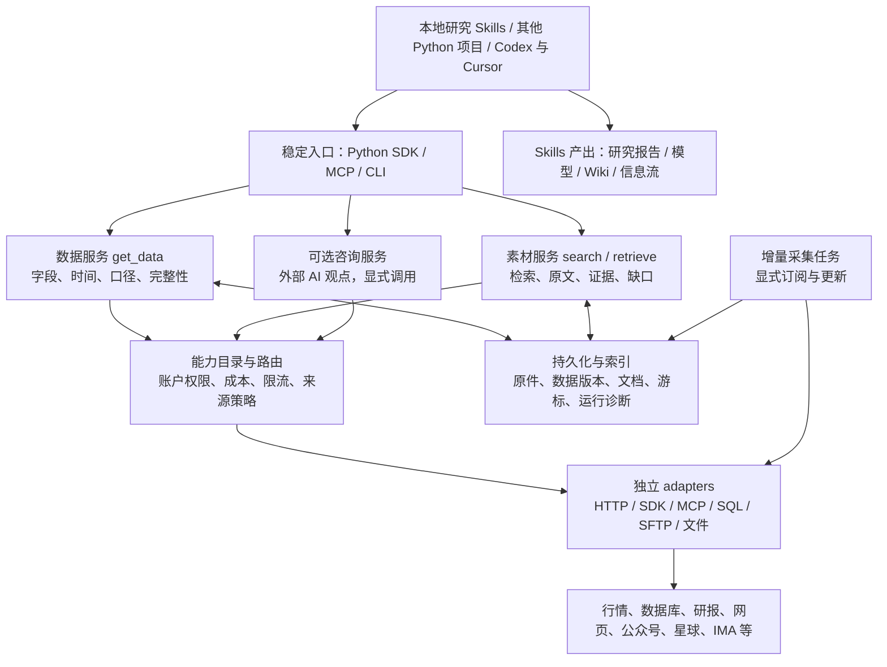

# ir_search 改进计划书：面向各类投研 Skills 的数据与证据服务

> 历史设计记录：本文的阶段状态和默认来源描述对应当时版本。当前实现、用户选源规则和待测试事项以 [HANDOFF](../HANDOFF.md) 及[能力清单](current_capabilities.md)为准。

版本：方案 v1.2；更新日期：2026-09-13；状态：最小框架、首批 Wind/JYDB 接口、A 股日线回退及 AKShare 近期分钟接口已实现，凭证配置与在线验收待完成。

本文根据代码、华福培训 PPT、本地两组 skills，以及此前少量券商接口只读检查整理。**本文描述完整演进目标，实际实现范围见[最小框架说明](minimal_framework.md)和[Wind/JYDB 接入说明](wind_jydb_adapters.md)。** 已实现数据/素材契约、能力注册、请求预算、集中凭证文件、Wind 证券/日行情和 JYDB 公告文本接口。新 credentials.env 创建时凭证为空，来源默认关闭；未完成真实账户权限、单位及样本验收，阶段 A 在线来源验证及后续阶段仍需推进。

当前来源按数据类别拆分：**A 股和国内期货、期权等衍生品 EOD、公司财务：Wind MySQL → 缺失时 JYDB；近期日内：AKShare；较长历史日内来源留空。** 不自动加入第三个 EOD 供应商。Tushare 和 CNINFO 暂不优先重写；网页、公众号、知识星球、券商资料、IMA 属于后续素材入口。实际实现与待映射品类见[市场数据来源规则](market_data_source_policy.md)。

配套材料：[公开参考名录](external_references.md)（私有技能库存不随交接分发）。

## 1. 执行摘要与实施顺序

**建议先做最小框架：用 3–5 个工作日确定公共接口、数据与证据模型、能力边界和诊断方式；随后立即用真实 adapters 与 skills 打通完整调用。来源权限和返回样本的核验与这一步同期进行。**

推荐顺序：

```text
确认真实使用场景与来源小样本
  → 建立最小接口和结果模型
  → 打通一个数据来源 + 一个原文来源
  → 用已有 skills 验证并修正接口
  → 扩展财务、基金、海外与私域来源
  → 补齐增量、版本与运维能力
  → 稳定后整理包边界，持续适配新 skills
```

这里“先做框架”有明确范围和结束条件。首轮只建立让数据和素材可靠返回的骨架，不要求完成全部目标目录、全品种数据模型、向量检索或所有来源接入。

### 1.1 为什么这个顺序适合本项目

1. **现有结果模型存在结构性限制。** 行情等数值目前被包装成 Hit，再按 URL 去重；先扩展更多数据源会继续受到这个限制。
2. **真实来源决定接口细节。** 数据供应商的分页、权限、历史覆盖和返回类型不一致；框架必须很快接受真实样本检验。
3. **已有搜索与证据功能可复用。** 首批新增 get_data 和 retrieve 可以逐步接入，保留现有 search、抓取、抽取及 MCP 入口。
4. **最终验收对象是调用方。** 完成一个来源的连接后，还要证明已有 skill 能正确读取、计算或引用其结果。

因此，依赖顺序上是“最小框架先”，工作方法上是“框架、adapter、skill 逐条打通”。adapters 的调查可以先行，正式实现依照公共契约展开。

### 1.2 项目目标

**让后续各类投研 skills 和其他项目，通过稳定的 Python SDK / MCP 调用 ir_search，获得可计算的数据和可追溯的研究素材。**

适配新 skill 时，优先复用已有数据集和检索能力；只有出现新的数据种类或口径时，才扩展公共能力。skill 不需要重复维护来源登录、分页、重试和凭证。

目标是让本地 skills 和其他项目通过 ir_search 获得两类可复用输入：

1. **计算用数据：**有字段、单位、日期、版本与完整性说明的行情、财务、基金、因子、宏观和产业数据。
2. **研究用素材：**有原文定位、来源关系、发布时间、权限和检索缺口的公告、研报、纪要、网页、公众号与个人资料。

第三类接口是**外部生成观点**。本地中金技能调用 DeepAgent 回答；华创也包含首席/大师 AI 和异步研究任务。这类能力可按需接入，但不能作为上述两类输入的隐式替代。其运行应显式、可计费追踪，并位于确定性搜索之外。

研究方法、估值假设、归因公式、报告结构和用户判断由上层 skills 负责。ir_search 提供清晰的数据与证据边界，并持续增强可靠性与覆盖面。

### 1.3 首版成果与范围

首版以四类调用方为完整验收样板：**财务分析、基金 Brinson 归因、轮动分析、AI 研究周报**。更早的原型先只验证日度复盘的行情/公告部分和周报的素材部分，不把这些局部演示称为整套 skill 已迁移。

首版必须交付：

- 可直接调用的 SDK 与 MCP 入口，以及调用示例和字段说明。
- 行情、财务、基金三类计算数据的必要子集；至少验证国内与海外两种市场的数据差异。
- 官方披露及至少一种研究资料/私域来源的原文与引用链路。
- 能力目录、请求预算、失败隔离、部分结果、凭证隔离和可追溯诊断。
- 最小持久化、版本与增量恢复；四类 skill 的端到端验收记录。

完整的国际数据覆盖、所有私域平台、IMA 全量同步、外部 AI 咨询、复杂语义检索和知识图谱按后续阶段扩展。首版的来源与数据集数量最终受业务权限验证约束；缺少必要数据时，相应场景明确保持未验收状态。

与已有 [Personal Information Flow 方案](personal_information_flow_project_plan.md) 的关系：该方案覆盖捕获、信息流、知识积累和通知等较大范围。这里将通用数据/证据核心作为前置阶段；信息流复用其存储、抓取和诊断。六小时推送、手机入口和知识库投影属于后续消费应用，本次不创建任何定时任务。

## 2. 对当前架构的评价

应保留的基础：确定性搜索、实体识别、来源路由、显式 fallback、原文读取、EvidenceSpan、来源层级、官方证据缺口和测试体系。它们已经接近一个可靠证据引擎的底座。

需要调整的是数据类型边界、来源能力粒度、持久化和模块依赖，而非全面重写。

| 现状与依据 | 影响 | 改造方向 |
|---|---|---|
| `adapters/base.py` 以 `query(Query) -> list[Hit]` 为统一接口 | 数据集和文档检索混用一个协议 | 增加数据、发现、正文、增量等能力协议；允许一个来源实现其中部分 |
| `adapters/tushare.py` 将每条记录变成同一 API/证券 URL 的 Hit；`pipeline.py` 按 URL 去重 | 同证券不同交易日记录会被合并，无法保留完整序列 | 结构化数据走 DataResult；按数据主键处理版本，不经 URL 去重和搜索 Top N |
| Tushare 当前参数用固定近 30/730 天，结果存在 10 条限制 | 不满足用户明确区间、分页、历史财务/因子请求 | 请求显式包含日期、字段、频率和分页，返回实际覆盖与截断说明 |
| 当前数据记录还用媒体 tier；来源能力防火墙以大类判断 | 无法表达实际/预测、快照/历史、真实/近似 OHLC | 将供应商、原始发布者、内容类型、处理方式、字段覆盖分开 |
| `source_health.py` 主要检查配置和 adapter 状态 | 配置存在不代表登录、权限、接口或业务数据正常 | 按来源与操作提供分层状态及有时间戳的主动探测 |
| `kernel.py` 集中构造来源；搜索入口包含自动代理配置 | 难以隔离账户、并发请求和不同运行环境 | 注入请求上下文与 transport；初始化过程集中在 composition root |
| `documents/store.py` 有存储工具，但尚未形成贯通的增量入库与版本链 | 重复读取、缺少持久游标和历史回放 | 接通原件、元数据、文档版本、全文索引、游标与运行记录 |
| ZSXQ/Longbridge 存在部分子请求成功后不抛出其余失败的路径 | 表面成功掩盖覆盖缺口 | 结果 envelope 保留每个子请求状态，允许 partial_success |
| `DajialaAdapter` 导入仓库顶层 `tools.gzh_fetch` | 与包外脚本耦合，需检查安装后可用性 | 移入可安装的来源客户端/可选模块，补干净环境安装验证 |
| `research/` 与 `research_synthesizer/` 存在不同研究编排实现 | 责任、成熟度与调用入口易混淆 | 选定现有主入口，保留兼容层，清理重复的占位实现 |

另一个需要先核实的配置问题：当前 Tushare 客户端默认 HTTP 目标为第三方域名。来源品牌、协议兼容性和真正接收凭证的服务不能混为一谈。改造时采用明确的 endpoint/provider 配置与凭证绑定；本次未向该目标发送用户 Key。

当前规则式 claim verification 可以帮助定位支持、冲突与证据不足；它不等于事实证明或模型结论正确性的保证。后续仍应展示证据跨度和口径，让上层研究者核查。

## 3. 目标结构



图中咨询服务共用连接和鉴权基础设施，但不进入 search/get_data 的自动回退路径。研究 skills 消费返回结果，负责研究方法与成品表达。

### 3.1 adapters 独立到什么程度

首阶段采用同仓库内清晰的包依赖；不立即拆成多个仓库或微服务。

adapters 只做认证、请求、分页、限流、供应商字段映射与来源元数据，依赖共享 contracts 和基础设施，不反向调用 search、deep_research 或某个研究 skill。字段标准化要分层：供应商字段映射在 adapter，跨源单位/口径核对在数据服务，投资分析公式在方法层。

稳定后若存在独立发布或其他工程复用 adapters 的实际需求，再拆包。其他项目只想取数时，直接调用 ir_search 的 SDK，无须先运行 MCP 或报告生成器。

### 3.2 建议目录与依赖

```text
ir_search/
  contracts/          # 公共请求/响应、枚举、来源与诊断模型
  adapters/           # 按 provider 组织，多能力、可选依赖
  infrastructure/     # transport、凭证解析、存储、缓存、限流
  registry/           # 能力目录、数据字典、来源配置及检查
  services/
    data/             # 确定性数据路由、规范化、质量与完整性
    search/           # 现有搜索能力逐步迁移
    retrieval/        # 搜索结果 -> 原文 -> 可引用素材包
    ingestion/        # 初始同步、增量、修订和删除状态
    evidence/         # 证据跨度、来源关系、冲突与核验
    advisory/         # 可选外部生成服务，独立执行路径
  research/           # 有预算边界的证据编排，调用 services
  interfaces/         # SDK / MCP / CLI 薄封装
  __init__.py         # 兼容已有公共入口
```

依赖方向：interfaces/research → services → contracts + registry + adapters/infrastructure。该目录是演进目标，逐个迁移模块并保持旧入口兼容；首轮只增加当前闭环所需的模块。

### 3.3 首轮最小骨架

| 必须先落定 | 首轮具体范围 | 结束条件 |
|---|---|---|
| 请求与结果 | DataRequest/DataResult、MaterialBundle、通用 Diagnostics；AdvisoryResult 只预留类型边界 | 行情和公告真实样本可表达，旧 Hit 继续服务文档搜索 |
| 数据集字典 | 证券标识、日行情；公告与网页原文类型 | 必需字段、单位、时间、分页和缺失语义明确；财务/基金字段后续按样板增加 |
| 能力注册 | 来源、操作、市场、覆盖、权限状态与接口版本 | 可以解释一次请求为何可路由或被拒绝 |
| 请求上下文 | 总时间/请求次数预算、来源配置、账户范围、取消状态 | 无须每个 skill 单独传递 Key 或修改全局代理 |
| 公共入口 | get_data / retrieve 的服务边界，SDK/MCP 共用实现 | 有最小调用样例与契约测试，接口骨架可接真实 adapter |

以上完成就进入首批接入。接口先按 v1 版本约束管理，新增可选字段保持兼容，改变字段含义或删除字段必须有版本与迁移说明。

## 4. adapters 改造

### 4.1 按能力注册，而非一个供应商一个 search 方法

| 能力 | 输入/输出方向 | 例子 |
|---|---|---|
| `describe` | 数据集、字段和服务能力 | 财务字典、时间范围、资产覆盖、频率 |
| `query_data` | DataRequest → DataResult | 日行情、财务、预测、基金净值/持仓、因子 |
| `search` | SearchRequest → 候选资料 | 研报筛选、星球主题搜索、全网发现 |
| `fetch` | 来源 ID/URL → 原文或明确状态 | 公告 PDF、公众号正文、纪要、附件 |
| `iter_updates` | 游标/窗口 → 变更批次 | 星球新主题、SFTP 新文件、公众号更新 |
| `health` | 探测范围 → 分层诊断 | 配置、依赖、认证、操作授权、业务样本 |
| `consult`（可选） | 显式问题 → AdvisoryResult | 中金 DeepAgent、外部研究问答 |

这里是能力协议，不要求所有 adapter 实现所有方法。不会同步的来源返回不支持；不能读取全文的来源不得拿摘要冒充全文。

### 4.2 三种结果契约

**DataResult：给计算使用。**

- 数据集、字段定义、原始字段与映射版本；数值、单位、币种、频率与缺失含义。
- 证券稳定标识及上市地点；证券代码是可变映射，不能只靠名称。
- 观察时间、报告期、披露/公开时间、抓取时间、版本与 `as_of` 策略。
- `value_kind` 明确实际值、单家预测、一致预期、用户假设、计算派生值。
- 复权、分红、交易日历、行业体系、合并范围、累计/单季/TTM 等口径。
- 请求范围和实际范围、返回行数/总数或未知、截断、分页、缺口与质量标记。
- 逐记录/逐分区来源；大结果允许保存为有权限校验的本地文件引用，避免塞满 MCP 上下文。

业务主键随 dataset 定义。例如日行情为证券×交易日×频率×口径；财务还包含报告期、报表口径及修订版本。不同版本不覆盖、不按 URL 合并。

**MaterialBundle：给研究使用。**

- 文档/版本 ID、标题、原始发布者、内容类型、发布日期及其识别置信状态。
- 发现渠道、内容来源、原始链接或源内 ID；转载/引用/附件关系。
- 正文与证据片段、页码/段落/表格单元/音视频时间戳等可支持的定位。
- `text_origin` 区分原文、OCR、摘录、搜索摘要、机器生成摘要；摘要不得提升为已读取全文。
- 与问题相关的材料、相互冲突的表述、未覆盖子问题、访问/抽取失败与时效性。
- 私有/共享范围及可外发策略；跨不同权限范围的缓存与检索必须隔离。

**AdvisoryResult：给观点参考使用。**

- 服务与操作、查询、回答、生成时间、上游引用、已知或未知的模型信息。
- `generated=true`、使用量/耗时/任务状态；事实字段如无法回到原始依据则不自动导入 DataResult。
- 可以引用为“某服务生成的观点”，不能当成该分析师本人新发表的意见。
- 返回表格或 JSON 也可能来自生成过程，不能仅凭格式判为结构化事实。

### 4.3 能力粒度与回退规则

注册单位至少为 provider × operation × dataset × account scope。字段包括市场、品种、频率、日期深度、字段覆盖、是否可分页、时延、数据形成方式、授权范围、费用与最后验证时间。

路由顺序：先验证硬条件，再按用户偏好、来源适用性、质量、时效和成本选择。跨源比值之前，先对齐单位、币种、报告期和复权。缺失值不默认为零。

明确禁止静默等价替换：

- 指定历史期间 → 只有当前快照。
- 真实 OHLC → 用同一价格填四列的近似 OHLC。
- 全基金历史持仓 → 单季主动基金前 N 大持仓。
- 已披露财务 → 卖方预测或 AI 推测。
- 原始公告 → 讨论公告的媒体/社交摘要。
- 任意 SQL 被拒 → 生成型基本面分析。

允许降级时必须由请求显式允许，并返回兼容性与信息损失；不可满足则报告 `unsupported`、`insufficient_coverage` 或 `entitlement_denied`。

“官方优先”按问题适用：核查已披露财务优先公告，查卖方一致预期需要对应预测数据，查市场情绪允许社媒，查自有笔记允许私有库。所有材料保留明确来源类型，不用单一 tier 覆盖全部判断。

### 4.4 凭证与源内执行边界

凭证管理集中在本地环境变量/原生凭据库，skill 仅持有 source profile 名称。请求上下文按来源、账户和操作提供凭证，错误与诊断统一脱敏；不把 Key 放进提示词、URL 日志、缓存键、测试快照或交付文档。

MCP 采用只读工具白名单和参数 schema；列出工具不意味着自动开放所有工具。SQL 来源优先使用已审核查询模板和表/字段字典，遵守各数据库单表、行数及连接约束。SFTP 是批量同步，使用 manifest、校验和和游标。

Browser/OCR/Office/SQL/行情 SDK 作为可选依赖；一个来源依赖失败不能导致所有 MCP 工具无法启动。网络设置跟随 client/request，不通过修改进程全局代理变量影响其他请求。

## 5. 数据源接入路线

优先级以下游工作流覆盖和实际账户能力为依据，先验证再承诺。现有有权限的数据应优先复用，不按源数量追求重复接入。

| 组别 | 候选来源 | 第一轮目标 | 当前限制/验收前提 |
|---|---|---|---|
| 国内 EOD / 公司财务 | Wind MySQL → 缺失时 JYDB | A 股日线在线验收；继续财务、期货/期权 EOD 映射 | 当前仅 A 股日线具备两个 adapter；权限、字段、单位与结算口径需按样本核验 |
| 国内近期日内 | AKShare | 先验收沪深 A 股分钟线，再接期货/期权 | 较长历史日内来源留空；夜盘交易日、合约单位、窗口与延迟单独声明 |
| 基金与因子 | 国金基金库、华源因子库、兴证 SFTP | 持仓/净值/基准、历史成分及因子面板 | 披露时点、历史覆盖、版本、编码和缺口；单季快照不能替代 |
| 券商资料与模型 | 华泰研报/估值、Alpha 派 recall、华创指定只读工具、中金 | 研报素材、模型实际/预测字段、纪要定位 | 华创 SQL 当前受限；中金已阅代码为生成回答；需逐操作验证 |
| 海外行情/财务 | 现有 Longbridge、Yahoo/yfinance、后续已授权商业源 | 港美股价格、公司行动和财务 | 各市场实时/延迟、历史深度和复权单独声明；不预设所有市场等价 |
| 官方披露与宏观 | CNINFO、交易所、公司 IR、SEC、FRED/ALFRED | 原始披露、财务事实、宏观指标及修订版本 | 当前仓库 SEC/部分交易所仍是 placeholder；官网有 API 不代表本项目已接通 |
| 公众号与开放网页 | 华创公众号工具、已有 Dajiala/OpenCLI、RSS、搜索引擎、公司网站 | 账号发现、列表、正文、更新分别注册 | 聚合服务为发现/传输渠道；保留公众号原发布者、转载关系及全文可用状态 |
| 私域与个人知识 | ZSXQ 官方 CLI、WeFlow、IMA、本地目录/Obsidian/有道导出 | 星球主题及附件、已有授权聊天记录、个人知识原文 | 微信聊天与公众号分开；IMA 原文、分页、增量、引用定位和权限需专项探测 |
| 产业与其他 | ESG 数据、矿企 IR、期货曲线、Polymarket、雪球/X/小红书 | 小范围高价值主题验证 | ESG 评分体系、期货合约与换月、事件市场规则、社媒采样偏差需记录 |

知识星球优先使用官方已提供的主题搜索/详情能力，避免新建重复的 Cookie 爬虫主链路。官方说明支持内容搜索及详情读取，但是否能覆盖目标账户的全部历史与附件，仍需业务验证。[知识星球官方工具说明](https://doc.zsxq.com/zsxq-skill-ai-tool-guide.html)

SEC 与 FRED 是补足海外原始证据和宏观时点数据的合理候选；FRED 提供序列更新及修订日期能力，设计时应保存 vintage，而非只覆盖为最新值。[SEC 开发者资源](https://www.sec.gov/about/developer-resources)、[FRED API 文档](https://fred.stlouisfed.org/docs/api/fred/)

IMA 官方存在 Agent 接口页面，但本次可读取内容不足以核实其具体契约。因此列入探测阶段：分别验证知识库列表、检索片段、原文/文件、引用位置、分页、更新及删除通知；无法原生读取的内容提供本地主动导出入口，不承诺同步全量。[IMA 接口页面](https://ima.qq.com/agent-interface)

## 6. “智能搜索”具体交付什么

首版交付可直接作为 skill 输入的素材包：

1. 解析实体、研究问题、时间范围和资料类型，明确哪些子问题需要数据、哪些需要文档。
2. 同时检索已入库内容与请求允许的在线来源，记录查询计划和预算。
3. 读取可访问原文，识别转载与文档版本，保留来源链。
4. 用实体、关键词、标题/正文权重、日期、来源适用性进行确定性排序。
5. 返回相关片段与原文位置，分列事实披露、预测、观点和无法验证的线索。
6. 给出缺失证据、来源失败、时间不足和内容不完整等诊断；宿主 skill 再组织研究结论。

优先使用 SQLite FTS5/关键词检索、公司别名、行业术语和规则式查询扩展。向量检索仅在基准集上证明增益后作为可选能力；文档 embedding 可离线生成。若使用需要模型的查询处理，由显式上层工作流提供查询向量/扩展结果及模型版本，核心搜索不隐式调用 LLM。

“预期差”“公司核心假设”“产业影响”等理解可由上层 skill 提供结构化子问题；引擎负责可重现的检索与证据组织。智能搜索的验收应关注材料覆盖、引用准确和检索效果。

## 7. 入库、版本与增量

采用本地优先的最小存储组合：SQLite 保存文档、实体映射、游标、运行状态和全文索引；原件按内容 hash 存储；较大结构化数据按日期/数据集分区，列式格式可选。首阶段不引入必须常驻的消息队列、向量数据库或图数据库。

- 抓取与抽取分开：adapter 获取原件；extractor 处理 HTML/PDF/Office/OCR/音视频；证据层建立可引用定位。
- 同一文档经多个渠道发现保留多条发现记录；相同内容可复用原件，不虚增独立证据数。
- 修订与撤回产生新版本/状态，不覆盖历史正文；索引同步移除失效可见内容。
- 只有当前批次已持久化且可恢复后才提交游标。部分失败不跳过缺口；回放幂等。
- 查询式读取和定时增量共用客户端；首次全量导入、baseline、后续新增分别记录。
- 缓存键包含来源/操作、数据参数、as_of、版本和账户权限范围；不包含原始凭证。
- 权限不允许保留全文的来源只保存许可范围内的元数据/引用；无法持久化时明确降低可回放承诺。

知识库/Wiki 是上层研究记忆或阅读投影；原始证据与用户自己的判断分层保存，AI 更新不覆盖用户判断历史。

## 8. 面向 Skills 的公共入口

保留现有 `search`、`fetch_document`、`extract_evidence`、`verify_claims`、`deep_research`、`source_health`。新增接口分批推出，以下均为拟定名称：

| 入口 | 功能 | 首版建议 |
|---|---|---|
| `list_capabilities` / `describe_dataset` | 发现来源操作与可用字段、时间和口径 | 与 get_data 一同上线，避免 skill 猜字段 |
| `get_data` | 返回数据及完整性、口径和来源 | 先支持少量标准数据集 |
| `retrieve` | 返回可引用素材包 | 复用已有搜索、抓取、抽取，先服务研究周报 |
| `source_health` 扩展 | 配置/依赖检查与可选主动探测 | 默认轻量；主动探测有明确操作及成本范围 |
| `sync_source` | 初始化或增量导入 | 第二阶段，需要可恢复游标和状态 |
| `consult` | 外部生成观点 | 第三阶段可选，不能成为默认回退 |

所有 MCP 响应为 JSON 可序列化 dict；科学计算中的 NaN/日期/Decimal 等有明确序列化规则。SDK 可提供更方便的类型封装，但与 MCP 共用服务实现。

研究 skill 可以声明如下需求，避免写死厂商和凭证；这是未来 manifest 示例，不是现有接口：

```yaml
skill_id: earnings_review
requires:
  data:
    - dataset: financial_statements
      value_kind: actual
      pit_required: true
    - dataset: earnings_estimates
      value_kind: consensus
      pit_required: true
  materials:
    - filing
    - earnings_call
policy:
  allow_generated_data_fallback: false
  allow_partial: true
```

skill 在结果不足时缩小结论或报告缺口，而不是要求平台编造缺失数据。为旧 skill 保留少量适配 wrapper：替换取数入口，尽量保持研究框架与输出模板。

## 9. 实施路线、工作量与里程碑

工作量为规划估算：假设一名熟悉本仓库的 Python 工程师专注实施，包含相关测试、文档和样板验证；外部权限申请、供应商等待及新增非标准平台的研究时间另计。阶段按交付标准推进，不能因日期到了就视为完成。

| 阶段 | 主要工作 | 预计工作日 | 可展示的成果 |
|---|---|---:|---|
| A：最小框架与来源核验 | 公共契约、首批字典、能力与诊断骨架、来源小样本 | 3–5 | 能明确表达请求、结果与缺口的接口骨架 |
| B：首个完整调用 | 一个行情 adapter、一个原文 adapter、SDK/MCP、两类 skill 的局部接入 | 5–8 | skill → ir_search → 实际来源 → 可计算/可引用结果 |
| C：扩大场景与市场 | 财务、基金、必要历史口径、海外数据、研究资料；四类 skill 完整验收 | 8–12 | 同一公共服务支持财务、归因、轮动、周报 |
| D：稳定运行与增量 | 来源级故障隔离、版本/游标恢复、公众号/星球增量、发布兼容性 | 5–8 | 可以持续使用、重跑和定位问题的首版 |
| E：持续扩展 | IMA、更多国内外/产业来源、SFTP 因子、可选咨询、研究记忆 | 按能力单独估算 | 根据真实需要增加覆盖和研究工作流 |

阶段 A–D 合计约 **21–33 个工程工作日，约 4–7 周**。第一条真实调用链应在阶段 B 结束时可用。该估算针对上述限定首版，不包含所有本地 skills 的批量改写和所有数据源的全量接入。

### 阶段 A：最小框架与来源核验

工作：

1. 固定少量代表问题和预期输出，保存已有测试基线。
2. 核实首批来源的具体操作、认证与权限，保留脱敏小样本；区分握手、授权与业务数据问题。
3. 实现第 3.3 节的最小 contracts、能力注册与请求上下文。
4. 为结构化记录被 URL 合并、区间截断和权限误判建立回归样例。

验收：首批行情与公告样本可用公共模型表达；未知时间、缺字段、部分失败均可描述。至少确认一个数值来源和一个原文来源可取得合法业务样本。若只有离线样本，代码契约可继续验证，但在线链路保持未验收。

### 阶段 B：首个完整调用

首批选择：一个已验证的国内行情来源，以及一个官方公告/原文来源。优先复用现有实现；实际选择取决于阶段 A 的权限与字段验证，不固定押注某个未测供应商。

工作：

1. get_data 支持证券标识和指定区间日行情，绕开 Hit 去重，保留分页与真实记录数。
2. retrieve 复用现有搜索、抓取和抽取，返回原文定位及未读全文状态。
3. SDK 和 MCP 调用同一服务；加入最小结果快照、账户范围隔离和请求级诊断。
4. 改写日度复盘的行情/公告输入部分，以及 AI 周报的素材输入部分。

验收：外部项目和本地 skill 均可发起调用；数据可以进入实际计算，材料可以进入带出处的报告。供应商拒绝、超时和缺失内容会传递到调用方。局部迁移记录中注明未覆盖的 skill 功能。

### 阶段 C：扩大场景与市场

工作：

- 增加财务实际值/预测、基金持仓/净值/基准，补齐样板所需的公司行动、历史成分与公开时间。
- 验证一个海外来源或同一来源的海外能力，分别描述 A股/港股/美股覆盖，不能共用未经验证的假设。
- 增加至少一种研报、纪要、公众号或星球资料来源，保存可引用原文或明确的受限状态。
- 完成财务分析、Brinson、轮动、AI 周报四类 skill 的端到端调用。

验收：财务分析的表格与正文共用数据；基金归因说明持仓覆盖和残差；轮动使用合适的历史行情/成分口径；周报有原文和信息缺口。涉及历史决策的样板验证 as_of；无法确认公开时间时不得标记为 point-in-time 合格。

一期数据快照、Top N 切片或生成报告不能替代这些必要输入。某来源无权限时，可选择语义兼容的来源；仍缺必要数据则该场景不通过完整验收。

### 阶段 D：稳定运行与增量

工作：

- 在阶段 B 的最小快照基础上，完善文档/数据版本、索引、增量游标、重试与恢复。
- 对公众号或星球中已接通的来源实现增量；支持首次 baseline、更新与撤回状态。
- 按来源隔离并发、限流、请求超时、熔断及可选依赖；校验缓存新鲜度和权限。
- 完成干净环境安装、旧 SDK/MCP 兼容、文档与样板发布验证，整理实际形成的模块边界。

验收：同批重跑不重复，中断不丢失游标覆盖，返回旧缓存时标明实际时间；一个来源故障不使其他来源不可用。完成一个研究运行的回放与引用核查。

### 阶段 E：持续扩展

按研究价值逐项补国内外市场、产业数据、SFTP 因子、IMA 与其他私域平台；必要时增加宏观 vintage、更长历史和可选外部咨询。核心假设、预期变化、事件日历、Wiki 与信息流由上层 skills 消费公共服务。

新增一个使用已有能力的 skill，应能只修改该 skill 的调用配置/输入转换；新增同类 provider，通常只需 adapter、能力声明、字段映射和契约测试。若反复需要修改核心服务，先审视公共契约是否缺少真实通用能力。

## 10. 可靠性与验收标准

以下是拟定目标，不是当前已达到的指标。验收采用固定样本、故障注入和真实小样本分别记录；第三方服务可用性不纳入本项目可单方面保证的指标。

| 维度 | 首版验收目标 |
|---|---|
| 数据正确与完整 | 指定区间/字段完整返回，或显式列出缺口；不存在静默截断、跨日期误去重与实际/预测混用 |
| 来源追溯 | 样板中每条事实性引用可回到原文/原数据；生成观点和摘要单独标识 |
| 失败透明 | 覆盖授权拒绝、限流、超时、零结果、部分成功、旧缓存、未实现等固定故障样例，全部可诊断 |
| 执行有界 | 每次请求有时间与请求次数预算；重试只用于可重试操作，收到取消后不继续启动新子请求 |
| 故障隔离 | 单个来源认证、网络或可选依赖故障，不影响不依赖它的请求；公共服务可正常启动 |
| 凭证与权限 | 日志/响应/缓存中无 Key；不同账户范围隔离，受限来源不自动转交其他外部服务 |
| 搜索质量 | 建立不少于 30 个代表问题的固定评测集；标注关键应召回资料，记录 Recall@K、引用可定位率和人工遗漏，不仅比较报告文笔 |
| 可恢复与复现 | 重跑幂等；数据与文档版本可追溯；一次中断恢复和研究快照回放通过 |
| 调用方适配 | 四类样板端到端通过，并用第五个仅依赖已有能力的 skill 验证无须修改核心服务 |
| 向后兼容 | 原有测试通过；已有公共调用保持兼容；新接口、字段和限制有文档与版本说明 |

### 10.1 必须覆盖的验证场景

1. 两个不同交易日、同一证券/供应商 URL 的数据不会合并。
2. 指定区间、多页与超出数据上限时，完整返回或明确告知缺口。
3. 预测值不能混入实际财务；单季/累计/TTM、币种和单位不被静默混用。
4. as_of 之前不可得的财务/预测不进入历史样本；可得时间未知时明确标记。
5. 港股近似 OHLC、单季持仓和只返回 Top N 的数据不会通过严格覆盖检查。
6. 认证失效、权限不足、零结果、超时、无新内容、部分成功、未实现分别返回诊断。
7. mock/placeholder、摘要 fallback、生成观点和不完整提取始终可见。
8. 同一研报多次转载保留渠道，却不被算成多个独立证据。
9. 文档修订、权限撤回和增量中断可恢复，缓存不跨权限复用。
10. 常用四类 skill 在固定数据/证据样本上有端到端验收；公开函数按项目要求覆盖测试。

除单元和契约测试，还需要带日期的业务小样本验证。`tools/list` 成功不能替代 `tools/call` 成功；`tools/call` 成功不能替代返回质量合格。live 验证和离线 fixture 结果分别报告。

## 11. 迁移与回退方式

- 保留现有 search 与六个 MCP 工具；新增服务逐步加入，旧调用方可继续使用。
- 每批迁移采用“一个数据/素材能力 + adapter + 调用方 + 验证 + 文档”的交付单元，避免只移动目录而未改善行为。
- 旧行情 Hit 投影在迁移期明确标注为搜索摘要用途，完整计算数据通过 get_data 提供。
- 对照旧/新链路时比较记录数、字段、来源、引用和诊断。兼容差异可解释后再切换默认路径。
- 新来源和新路径可独立停用；数据库迁移保留备份与 schema 版本，不删除旧原件和研究快照。
- 回退只回到已验证的兼容实现或返回不可用，不能回到 mock/placeholder 并当作正常业务结果。

## 12. 第一轮可直接执行的任务清单

| 顺序 | 任务 | 输出 | 依赖 |
|---|---|---|---|
| 1 | 固定行情、财务、归因、周报的代表请求与现有基线 | 需求样例、已知缺口、测试结果 | 无 |
| 2 | 对首批数值/原文来源做操作级小样本检查 | 脱敏样本与权限/覆盖矩阵 | 任务 1；不等待完整框架 |
| 3 | 定义并实现最小公共契约、诊断与能力声明 | contracts v1、字段说明、契约测试 | 任务 1–2 的真实样本 |
| 4 | 打通一个行情来源，修复日期合并/区间/分页问题 | 可计算的 DataResult | 任务 3 |
| 5 | 复用搜索和全文能力，形成素材包 | 有原文定位和缺口的 MaterialBundle | 任务 3 |
| 6 | 暴露 SDK/MCP，接入两类 skill 的对应输入部分 | 第一条真实完整调用链与局部迁移记录 | 任务 4–5 |
| 7 | 根据调用方反馈调整契约，再进入财务/基金等扩展 | 稳定的 v1 接口及阶段 C 任务列表 | 任务 6 |

第一轮的核心成果是 **“skill 能通过 ir_search 取得正确的数据和证据”**。随后以四类样板完整验收证明通用性，再通过持续运行与第五个 skill 的接入验证其可靠性和扩展性。
