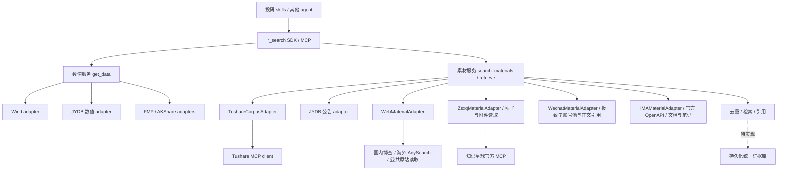

# Tushare、Wind、JYDB 协同接入方案

状态：2026-09-16 更新。IMA 知识库/笔记素材和授权原文已接入，见 [IMA 素材指南](ima_material_adapter.md)。素材契约、registry、`search_materials` SDK/MCP、JYDB 公告桥接、独立 `tushare_corpus`、公开网页 `web` 和知识星球 `zsxq` 已实现。Tushare 研报摘要/新闻/政策正文及网页政策/新闻/公司页面已完成有限真实取数与引用验收；Tushare 公告、问答、持久化索引和其他素材来源仍待开发。公众号账号池也已接入，见[公众号素材指南](wechat_material_adapter.md)。当前行为见[素材搜索](material_search.md)、[Tushare 语料指南](tushare_corpus_adapter.md)、[网页素材指南](web_material_adapter.md)和[知识星球素材指南](zsxq_material_adapter.md)，下文区分当前实现和后续设计。

## 建议：来源独立，服务统一

Tushare 大模型语料已单独实现 `TushareCorpusAdapter`，provider 为 `tushare_corpus`。Wind、JYDB 保留各自的 adapter；相同供应商的多个能力可以共享凭证与连接客户端。它们都属于同一个可安装的 `ir_search` 包，skills 继续只调用 `ir_search`。

供应商 adapter 负责认证、请求参数、字段归一化、分页和来源诊断。跨来源选择、去重、检索排序与引用应由服务层负责。这样新增新闻源、微信公众号、知识星球或 IMA 时，只需补来源映射，不必改动 Wind/JYDB 的数据库实现。

不建议把三家合并成一个巨大 adapter：它们分别使用数据库和远程 MCP，权限、限额、错误、更新时间与字段口径不同。合并会让一个来源的超时或格式变化影响无关查询，也难以说明每条证据的真正来源。共享连接治理和证据协议即可，不需要合并供应商身份。

图中 `search_materials`、素材 registry、TushareCorpusAdapter、WebMaterialAdapter、ZsxqMaterialAdapter、WechatMaterialAdapter、IMAMaterialAdapter 与内存中的去重/检索/引用已实现；其他来源和统一持久化索引仍为规划。`get_data` 与 JYDB 公告沿用现有能力；`retrieve` 已增加星球帖子/PDF 引用，统一 provider registry 分派尚未实现。

## 三家的实际分工

| 研究需求 | 来源安排 | 交付形式 |
|---|---|---|
| 国内 EOD、公司财务、期货/期权日线 | 继续 Wind 优先，缺失时 JYDB | 类型明确的数值表，沿用现有完整性、单位与版本约束 |
| 近期日内、美股公司数据 | 继续 AKShare、FMP 的既有边界 | 既有数值接口及其 partial 诊断 |
| 国内公司公告发现 | 当前 JYDB；后续增加 Tushare 公告元数据 | 当前保留 JYDB 来源；后续联合时保留两家来源记录及已取得的原文链接 |
| 公告内容 | 安全可取的原始 PDF/网页优先；JYDB 已有文本可快速读取 | 同时保留官方文件与供应商转录的身份，分别标记提取/截断状态 |
| 券商研报 | Tushare 先提供摘要、作者、机构和下载链接 | 摘要可用于发现；取得 PDF 后才提供全文片段/页码引用 |
| 政策、新闻、公司网页 | Tushare 提供语料 HTML；独立 `web` 按地区经博查/AnySearch 发现链接并按共享预算读取公开原站 | 取得的正文、搜索摘要、原始 URL、日期及未知/截断状态分别记录 |
| 星球讨论与附件 | 官方 MCP 有限时间流、帖子详情与可选评论；显式 PDF 读取 | UGC、来源片段/详情、角色区间、附件名元数据引用分别记录；不把转发文件默认提升为原始研报 |
| 互动问答 | Tushare 按沪深平台分别接入；目前仅深证样本已取到 | 保留问题/回答角色，不能将投资者提问当作公司的表述 |

Wind/JYDB 的数据产品可能还有更多材料，但当前私有库中未映射、未验收的表不注册为能力。新增 Tushare 语料套餐也不改变用户指定的 Wind → JYDB 数值路线。

## 最小框架增量

现有 `DataRegistry` 约束数值数据集，`search_announcements` 目前直接绑定 JYDB，`retrieve` 对 jydb:// 引用有专门分支。本轮已增加轻量 `MaterialRegistry`，让新素材接口使用一致的来源注册和诊断流程；没有重写整个项目。

本轮已增加 `MaterialSearchRequest`、`MaterialCapability`、`MaterialCandidate`、`MaterialSearchPage`、`MaterialSearchResult` 及素材 adapter 协议，复用已有 `RequestContext`、`Diagnostic`、`Provenance` 和枚举。注册信息表达素材类别、公司筛选限制、发布时间过滤、扫描方式与范围说明，不只是“供应商已连接”。以后再按实际来源增加分页和历史边界能力。

对 skills 暴露以下三个职责清晰的入口：

| 入口 | 作用 | 变化 |
|---|---|---|
| `get_data` | 行情、财务等数值 | 保留现有契约 |
| `search_materials` | 按主题、公司、日期及素材类型寻找候选材料 | 新增 SDK/MCP 工具；支持查询范围和来源预算 |
| `retrieve` | 取正文和引用片段 | 当前处理 HTTP(S)、JYDB 公告与知识星球帖子/PDF 引用；通用 registry 分派留待扩展 |

旧 `search` 和 `search_announcements` 保持可用。先把现有 JYDB 公告实现包进素材协议，保留旧入口的输出和默认行为，再让新 `search_materials` 按需联合 JYDB/Tushare。不能悄悄把旧接口结果从单一来源改成跨源混合结果。

不要把上游 253 个工具逐个转发为本项目的 MCP 工具，也不要新增允许任意 name/arguments 的通用代理。第一版只允许已核实的只读语料工具；p_save、p_delete 等不属于投研取数入口。schema 的动态发现用于健康检查和变化预警，新增名称/字段不自动变成可调用能力。

## 如何提供“智能搜索”

本次看到的 Tushare 语料工具主要是按日期、股票、机构等条件提取记录，没有看到相应工具支持任意自然语言语义检索。用户购买“大模型语料”不等于已经获得一个研究问答引擎；检索与证据组织需要在 `ir_search` 内完成。

当前首版使用可控范围的按需提取，再对标题和取得的文本做本地字符串匹配及排序，明确区分主题词与相关线索；未实现持久化索引。后续可加入本地持久化索引：公司代码/别名、主题词、日期、素材类型先缩小范围，再做全文检索。中文分词或字符索引必须经过样本测试，避免把整段中文当作一个词。可优先选择 SQLite FTS/BM25，并在安装环境检查相应能力。

在 `MaterialCapability` 中明确 `remote_keyword_search`、`remote_filters`、`full_text_available` 等能力。上游没有关键词查询时，只能对限定窗口内取回的记录本地筛选；结果必须说明实际扫描范围、是否截断、是否仅命中摘要，不能宣称“搜索了全库”。

有稳定文档积累后再增加可选的离线向量索引或混合检索。模型生成研究判断继续由调用方 skills 完成，不进入确定性搜索热路径；任何生成内容不得变成原文引用。

## 统一证据与数据质量

每条素材至少保存：内部文档 ID、供应商记录引用、原始 URL（没有就为 null）、内容类型、标题、公司/机构、原发布者、发布日期及精度、抓取时间、内容哈希、版本和正文/来源片段/摘要/搜索摘要/元数据状态。引用绑定具体内容版本和字符位置；当前素材服务不输出 PDF 页码，后续仅在解析并保留页码映射后提供。

Tushare 是数据提供方，原发布者可能是公司、政府机关、券商、媒体或提问者。供应商身份和原发布者身份应分别记录。政府 URL 可用于回溯，但供应商提供的 HTML 不因 URL 域名自动变成“已核验的官方原件”。不同 EvidenceType/SourceAuthority/SourceTier 分开赋值，不把整个套餐统一标成最高权威。

本次样本直接暴露的约束：

- **日期格式必须在客户端转换和校验。** 公告/研报使用 YYYYMMDD；政策/新闻使用完整日期时间。政策错误格式曾返回成功空数组，不能依赖服务端报错。
- **多个时间字段分别保存。** 问答 trade_date 和 pub_time 不同；通用“发布时间”筛选需正确映射到 pub_start/pub_end，并保留时间精度与来源，不能据此虚构 PIT。新闻切片要处理结束时间边界重复。
- **摘要、HTML、原始文件分开。** 研报 abstr 不是全文；政策/新闻 content 字段实际可能是 HTML，需要安全提取和正文质量检查，不能直接当成纯文本。
- **重复归组保留来源。** 公告 2 条记录指向 1 个 PDF；同一政策出现政府站和部委站版本。按 URL、文号、发行主体、报告 ID 及内容哈希归组；只按标题合并会误伤修订公告。不同渠道引用同一原文，不算独立交叉验证。
- **缺链接不可编造。** 互动问答样本无 URL，可用内部 `tushare://...` 记录引用并清楚标记 provider_record；不要拼接猜测的交易所网页链接。
- **空结果和失败分别诊断。** HTTP 200、isError=false 仅表示协议执行，不能证明覆盖完整。权限失败、超时或某一路空窗，在联合搜索中都应显示；其他成功来源的材料可保留为 partial。

数值数据继续按整次请求回退，避免混拼币种/口径。素材允许多个来源返回不同文档并联合排序，但每条的出处、缺口、版本和原件状态均可追溯；这两种规则不要混成一个 fallback 开关。

## 连接、凭证与可移植性

当前 provider 专用客户端包含 `TushareCorpusClient` 和 `ZsxqClient`，共享严格的 JSON-RPC 响应解析，保留各自认证、端点、协议版本和业务字段。Tushare 使用官方 HTTPS MCP 端点，在内存中从 `TUSHARE_MCP_TOKEN` 组装认证信息。为保持基础 SDK 的最小依赖，使用标准库实现已验收的 Streamable HTTP 子集，处理 JSON/SSE、长事件和会话，并施加响应大小、期限/取消、调用预算和工具白名单。不自动重试、发现目录或调用任意工具；提供 MCP 服务仍使用可选 MCP extra。

旧 `adapters/tushare.py` 是另一套数值搜索实现，使用不同凭证和可配置 HTTP 端点。新 Token 不映射给旧 adapter，不流向旧端点。两者要有明确的 provider 名称、配置和能力边界。

本机原有 Wind 非 TLS 选择和 JYDB TLS 设置继续保留。各来源分别配置，互不复制 Token/数据库密码。目录发现、业务权限、实际样本通过、最近健康状态分开记录；不因本机实测成功就在发布包写死 access=granted。

语料缓存/索引放在用户私有数据目录，支持容量、保留期限和清理；接口代码、映射、测试可进入 wheel，账号、语料全文、私人索引和账户工具清单不进入发布包。更换电脑仅安装 `ir_search` 并配置该电脑自己的 env，不能依赖 Desktop/BrokerSkills 或临时探针。

## 建议执行顺序与完成标准

1. **最小契约、registry、Tushare、首批网页及知识星球接入已完成。** JYDB 公告、Tushare 政策/新闻 HTML 和研报摘要、公开网页均已打通真实素材链路。接着用实际投研 skill 验证参数、范围诊断和引用使用方式，验收记录见 [Tushare adapter](tushare_corpus_acceptance.md)、[网页 adapter](web_material_acceptance.md)。
2. **完善正文和引用。** 网页原站读取、去重、内容版本以及知识星球帖子/PDF 读取已实现；星球验收见[记录](zsxq_material_acceptance.md)。继续扩展 retrieve 的 provider 引用和 PDF 页码映射，接入 Tushare 公告；清晰区分供应商文本与官方文件。
3. **扩展素材统一搜索。** search_materials 的来源选择、限定窗口提取、关键词排序与覆盖诊断已上线；后续增加更多来源和经过样本验收的中文全文索引，保留旧接口兼容。
4. **完善问答与增量索引。** 先验收沪深各自日期/分页和来源引用，再做显式批次同步、断点续取、缓存更新。知识星球的简化问答尚缺真实分离角色样本；公众号/IMA 已按同一协议进入，继续扩展覆盖。

第一轮不重做 Wind/JYDB 数值 adapter，不自动下载全库，不把未测试的 Tushare 数值接口加入回退列表。

完成标准包括：每类至少有非空真实样本；参数错误/权限/限流/空窗诊断可区分；同一原文的重复记录归组但不丢来源；每项正文引用能定位到已保存内容；最近信息显示覆盖窗口；无 LLM 搜索热路径；新增公共函数有测试；全项目测试通过；wheel 脱离源码验证 SDK/MCP/资源及私有文件排除。
