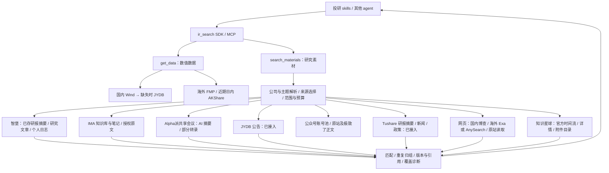

# 素材搜索接口：统一的研究证据入口

2026-09-17：已实现 `search_materials` Python SDK/MCP、素材契约、独立来源注册、确定性检索与引用，并接入 JYDB 公告、Tushare 研报摘要/新闻/政策正文、公开网页 `web`、知识星球 `zsxq`、公众号 `wechat` 、IMA `ima` 和智堡 `wisburg`。实现位于可安装的 `ir_search` 包内，无 Desktop/BrokerSkills 运行依赖。

分工是：**skills 决定研究问题、时间与口径，并形成研究判断；ir_search 负责按范围取材、组织证据、记录出处和暴露缺口；adapters 负责各来源的连接和字段映射。**



## 已实现的行为

| 问题 | 处理方式 |
|---|---|
| 电话会、研报、小作文可能来自多个渠道 | `material_type` 记录内容类型；`channel` 与 `provenance.provider` 分别记录渠道和供应商。没有把星球等同于研报类型 |
| “贵州茅台 9 月动销”缺少年份 | 返回 `required_inputs`，不默认某一年。必须提供文档发布范围；问题含月份时还需要业务期间 |
| 10 月发布的文章讨论 9 月动销 | `published_start/end` 控制文档筛选；`period_start/end` 表达业务期间。未知业务期间保留并警告，不从发布日期推断 |
| 同一公司有多种称呼 | 使用包内公司字典解析名称、别名与证券代码；字典之外可显式给 `symbols`、`entities` |
| 动销经常和批价、库存一起出现 | 动销/终端销售/终端销量为主题词；批价/库存/回款等单独标为相关线索。关键词命中不等于已取得动销测量值 |
| 不同渠道转载相同内容 | 相同原始 URL 或相同类型、相同文本层级的完整长文本归组，保留各来源与版本。搜索摘要、来源片段、截断文本和相似标题不作为跨 URL 合并依据 |
| 引用需要可核对 | 每个版本包含内容哈希、标题与取得的文本；引用标出 `source_part`、字符起止位置和 `version_id`。缺少网页原件时 URL 为 null，不编造页码 |
| 来源不可用或扫描受限 | 每个来源分别返回状态、扫描条数、命中条数和诊断。失败不抹去其他来源结果；未注册来源、正文读取预算和结果数量限制均可见 |

首版使用显式词表和本地字符串匹配；没有持久化全文索引、语义检索、自动冲突判断或自动研究结论。输出 `topic_term_match` 只是主题词命中，`related_term_match` 只是相关词命中。所有来源文本均标记为不可信输入，不作为 agent 指令执行。

`text_scope` 区分 `metadata`、`abstract`、`search_snippet`、`source_excerpt`、`extracted_text`；`source_excerpt` 表示完整性或角色尚未确认的来源文本；搜索摘要不等于原文，供应商文本仍不等于已核验的原始文件。哈希和引用绑定的是本次实际返回的文本，截断时不代表全文件哈希；目前未自动持久化正文，调用方需保存返回结果以供之后复核。

## 当前真正接入的范围

- **SEC `sec`**：支持 `symbols` 或 `sec_ciks`、精确 `sec_forms` 筛选，按预算读取 EDGAR 官方主文件并返回附件链接。原版/修订版按申报号保留身份，申报日与报告期末分开。配置、调用与范围见 [SEC 指南](sec_filings_adapter.md)。

`list_capabilities` 新增 `materials` 部分，区分实际注册能力与未注册来源意向。查看目录不会发起网络请求，也不证明账户权限已经通过。

- **JYDB**：复用本机现有配置，支持单个 A 股发行主体、显式发布日期范围内的最新一页公告元数据，并按预算读取该页前若干条公告文本，再进行关键词匹配。没有分页续取或全库搜索。
- **Tushare 语料**：启用私有配置后注册独立 `tushare_corpus`，支持研报摘要、新闻和政策正文，三类已通过有限实取。研报按单只 A 股查询最后至多 31 个自然日，未指定股票时为最后一天；新闻与政策仅查请求范围最后一天，新闻使用配置媒体。取回后按预算读取前若干条并在本地匹配，不是整个请求窗口的全库搜索。见 [Tushare 语料指南](tushare_corpus_adapter.md)。
- **网页**：启用后注册独立 `web`，支持按 `web_region=auto/cn/overseas/both` 将国内请求路由博查、海外请求路由 AnySearch；跨地区共享总计至多 10 个候选链接及正文预算，再读取公开原站。支持 `web_page`、`news`、`policy`，分类为保守规则；日期在取得元数据后本地过滤，未知日期保留并警告。两家使用分离的 Key；AnySearch 另保留显式匿名配置；政策、新闻和公司网页已完成有限真实验收。见[网页素材指南](web_material_adapter.md)。
- **知识星球**：独立 `zsxq` 通过官方 MCP 按时间读取有限星球与帖子，按预算读取详情和可选评论，本地匹配标题、已取得文本与附件名。普通帖子为 `social_post`，问答为 `qa`；均保留 UGC 身份。详情与来源片段、作者角色、附件目录及引用分开记录。见[知识星球素材指南](zsxq_material_adapter.md)。
- **公众号 `wechat`**：极致了账号池取材，按配置账号和预算扫描最近发文，正文优先读取原站，再显式标记供应商补充读取；新增 `wechat_accounts` 账号筛选和 `text_provider` 文本提供方。详见[公众号素材指南](wechat_material_adapter.md)。
- **IMA `ima`**：知识库与本人笔记的有限关键词搜索及授权原文读取，类型为 `document/note`；笔记创建/修改时间独立于发布日期，未知日期不做推断。见 [IMA 素材指南](ima_material_adapter.md)。
- **Alpha派 `alphapai`**：手机号密码登录，共享会议目录和已有 AI 摘要的有界检索；`retrieve` 通过 `alphapai://meeting/<ID>/summary|transcript` 分别读取摘要和可取得的机器转录。短期私有缓存、权限/额度、ID 变化、日期与部分文本诊断均保留。仅启用配置时注册；不要求 Open API Key，个人录音和全库研报尚未启用。见 [Alpha派指南](alphapai_material_adapter.md)。旧 `search` 仍按其旧契约运行，不自动接入此来源。

数值数据路线、旧 `search` 和 `search_announcements` 保持既有行为。`retrieve` 处理 HTTP(S)、`jydb://announcement/<id>`，并增加 `zsxq://topic/<group>/<topic>` 和 `zsxq://file/<group>/<topic>/<file>`。其他供应商内部引用的通用 registry 分派仍未实现。

JYDB 在新入口仅标注公告发布日期；现有库的时间精度未经核实，`published_at` 保持 null。业务期间也保持 null。所有当前素材搜索返回 `partial` 或 `unavailable`、`complete=false`，不会把有限扫描宣称为全覆盖。

## 用户选择来源（0.2.0rc1）

用户自主选择素材来源，调用方沿用其已有选择或展示可选来源。未选时不自动按字母顺序、账户已启用情况或默认四家发起请求；dry_run 也不代选。详见[选择与迁移契约](source_selection.md)。以下旧日期记录保留历史样本，当前选择规则以此为准。

## 网页额度回退

公开网页路线明确额度耗尽时，结果新增 `fallback_requests`，由调用方使用自带 Web Search 接续，再调用 `retrieve`。原引擎失败、待接续状态和覆盖缺口保留；普通限流不触发，原生搜索尚未执行时不能视为证据。详见[契约、预算与调用规则](web_search_fallback.md)。

## skills 的调用方式

### 有界续取（2026-09-17）

知识星球、公众号和 IMA 在 `coverage[].continuation_cursors` 返回可继续的扫描位置。下一次请求把这些字符串原样传入 `source_cursors`，并显式指定对应 `providers`，保留问题、实体、关键词及日期范围。可以调整候选、正文和时间预算。MCP 接受同名字段。

```python
from dataclasses import replace
from ir_search import MaterialSearchRequest, search_materials

request = MaterialSearchRequest(
    "投资", providers=["ima"], keywords=["投资"],
    published_start="2026-09-01", published_end="2026-09-17",
    candidates_per_source=10, text_reads_per_source=0,
    ima_include_notes=False, limit=50,
)
first = search_materials(request)
cursors = tuple(c for source in first.coverage for c in source.get("continuation_cursors", []))
if cursors:
    following = search_materials(replace(request, source_cursors=cursors))
```

- 游标保存的是**候选扫描位置**，不是排序后结果的页码；过滤未命中或 `limit` 截断的结果不会在下一页重新出现。需要批量收集时，逐来源调用并令 `limit >= candidates_per_source`，自行按来源引用去重。
- 同一上游页超过剩余预算时保留页内偏移和该页摘要；续取时若页面已变化，返回 `material_cursor_stale`，调用方从该来源重新扫描并按引用去重，不静默跨过记录。
- 星球保留最近一页的主题 ID，处理实测发现的相邻页重复边界。新增 `zsxq_group_ids` 可指定已配置范围中的星球；没有本地列表时，仍由上游账户授权约束。
- IMA 的结束标记优先于残留游标；未提供翻页标记时，只能续读当前页尚未检查的记录，不推测存在下一页。笔记遵循官方偏移上限 1000。
- 公众号使用已配置账号池及原有历史缓存。IMA 保留 `ima_knowledge_base_ids` 和 `ima_include_notes`；续取不放宽本地选定范围。
- 游标不是授权凭证，也不是完整性证明。它含来源范围及上游位置，应与私有结果一起保存；不要提交到公共仓库。未开始扫描的来源、知识库或关键词不自动获得游标，仍需调用方显式选择。所有有限扫描继续返回 `complete=false`。

本轮实测见[现有来源可用性验收](source_usability_acceptance.md)。

调用前用 `list_capabilities()` 查看 `materials`。异地安装或从其他项目启动时，将 `IR_SEARCH_CREDENTIALS_FILE` 指向该电脑自己的私有 env，配置方法沿用[独立部署指南](standalone_deployment.md)。

以下示例中，调用方已经明确选择 **2025 年 9 月**；发布日期留到 10 月，以允许随后发布的回顾材料进入候选。这个示例不保证有动销素材命中。

```python
from ir_search import MaterialSearchRequest, search_materials

result = search_materials(MaterialSearchRequest(
    question="贵州茅台9月动销",
    symbols=["600519.SH"],
    published_start="2025-09-01",
    published_end="2025-10-15",
    period_start="2025-09-01",
    period_end="2025-09-30",
    keywords=["动销"],
    max_sources=4,
    candidates_per_source=20,
    text_reads_per_source=3,
    limit=20,
)).to_dict()
```

MCP 使用 `search_materials` 工具，参数与上例相同，直接提供字段，不包在 `request` 中。必须显式传入用户选择的 `providers`，可另指定 `exclude_providers` 和 `material_types`。省略/空来源返回 `required_inputs` 与 `plan.source_options`，不调用来源。显式指定当前未注册的来源会返回缺口。

支持的内容类型：`announcement`、`research_report`、`call_transcript`、`channel_check`、`news`、`policy`、`qa`、`opinion`、`web_page`、`social_post`。这些是协议枚举，不代表当前都已有正式 adapter；`web_page` 表示尚未归入具体类别的网页。

预算上限：最多 8 个来源、每源 50 条候选、每源 10 次正文读取、每条 50,000 字符、最多 50 个文档组。默认值分别为 4、20、3、20,000、20；发布日期窗口最多 367 个自然日。实际来源约束、请求操作预算及总期限可能更小；MCP 默认总期限 30 秒。实现不主动无限翻页或重试。

Tushare 的 `coverage[].scans[]` 按内容类型列出实际子查询起止日期、媒体/股票筛选、状态、上游收到数与本地检查数。公共请求允许 367 天不代表该来源扫描了 367 天。该来源最多调用 3 个业务工具，候选预算在类型间分配；新闻和政策分享正文解析预算，研报摘要不占单独全文读取次数。上游可能返回超过本地候选预算的记录，其全文并不一定被解析或检索。

`scans[].date_filter_basis` 默认 `upstream`，表示 Tushare 等来源的上游子查询日期边界；网页为 `local_publication_metadata`，起止日期仅表示本地发布日期过滤边界。网页把日期作为搜索文字提示，不能据此宣称上游搜索已限定日期或穷尽窗口。日期未知仍可返回，已知且越界的页面剔除，原站日期优先于搜索元数据。网页记录另含 `discovery_provider`，用于区分搜索服务、接入来源和原站域名。网页 `scans` 同时披露所选引擎、`web_region`、`routing_basis` 及每路状态；自动地区识别只是可覆盖的规则，未知时的语言默认值明确标记。所有子查询失败时为 `source_queries_failed` / `unavailable`，失败不作为成功空查询。

知识星球的 `scans` 另含 `collection_id`、`has_more`、`next_cursor`，区分每个星球的实际扫描和失败状态；同样按本地发布日期过滤。`sections` 保存作者角色和字符区间，无法确认的问答角色标为 `unverified`。附件名也可匹配，但引用标为 `source_part=attachment_name`、`text_scope=metadata`，通过 `attachment_index` 定位文件名；不能据此认为已读附件正文。

skills 处理返回结果时，应先看 `required_inputs`、`coverage`、`gaps`、`diagnostics`，再看 `items[].versions[]` 的 `match`、`warnings` 和 `evidence_spans`。日期未知、只有摘要、只有标题、仅相关线索或转载来源尚未证明独立时，不应据此输出确定的经营指标。

每个来源的 `coverage[].returned_evidence` 汇总最终返回材料的实际证据层级，取自旧研究编排中“搜索命中和取得证据分开统计”的能力，按新素材契约重写：

| 字段 | 含义 |
|---|---|
| `scope` | 固定为 `returned_items_after_limit`，统计归组、排序、结果限额之后真正返回的版本 |
| `document_groups` / `source_records` | 此来源出现于多少文档组、提供多少来源记录；同一文档的多条来源记录仍保留 |
| `text_scope_counts` | 分别统计 `metadata`、`abstract`、`search_snippet`、`source_excerpt`、`extracted_text` 记录数；取得文本可能被截断或来自供应商转录 |
| `citation_scope_counts` | 按相同五种层级统计引用片段；正文材料的标题引用也计入 `metadata`，搜索摘要引用不等于原文引用 |
| `truncated_records` | 已返回记录中带文本截断标记的数量 |
| `publication_date_unknown_records` | 已返回记录中缺少发布日期的数量 |
| `business_period_unverified_records` | 调用方要求业务期间，但材料期间未知的已返回记录数量 |

`scanned_count`、`matched_count` 仍分别表示来源页扫描数和结果限额前的命中数。返回证据计数为 0 不等于源内无材料：必须结合来源状态、限额和诊断阅读。同一文档在两家来源的各自统计中均可出现，不能相加当作独立交叉验证。摘要、标题和已提取文本计数也不代表已核验原始文件或确认研究结论。

## 验证记录与下一步

2026-09-15 对 JYDB 做了一次限量只读验收：贵州茅台，2025-04-01 至 2025-04-30，关键词“年度报告 / 营业收入 / 利润”，候选预算 3、正文读取预算 1、正文上限 5,000 字符。

- 3 条元数据进入结果，1 条取得 5,000 字符截断文本，另 2 条明确为元数据。
- 返回 4 处字符引用；引用逐项与返回版本中的标题/正文切片核对。
- 结果为 `partial`，保留扫描不完整、正文读取预算用尽、时间精度未核实和文本截断标记。
- 此验证仅证明已有 JYDB 公告经新入口可用，不证明“9 月动销”场景或其他材料来源已验收。供应商原文及私人验收结果不进入发布包。

验证通过：全项目 `python3 -m pytest -q` 为 **868 passed, 8 skipped**；带可选依赖的 Python 3.12 环境验证素材、框架 MCP、FMP 和独立安装测试为 **106 passed**，包含真实 FastMCP 工具注册/调用，以及构建 wheel 后在无源码目录、禁网络、无私有凭证环境中的 SDK/MCP/资源检查。主环境跳过项含未安装的可选运行时；没有将跳过视为通过。

同日后续已完成独立 `TushareCorpusAdapter`：真实 SDK 返回 5 份研报摘要、3 篇新闻正文、2 条政策发布记录，共核对 28 处字符引用；真实 MCP 另核对政策 6 处引用。详细范围、新闻大响应修复及最新测试结果见 [Tushare 正式素材验收](tushare_corpus_acceptance.md)，上面的测试数字保留为此前 JYDB 阶段记录。

同日后续已完成独立 `WebMaterialAdapter`：政策、新闻、公司网页共保留 6 篇原站正文和 1 条搜索摘要，逐项核对 18 处原文引用及 1 处摘要引用，包含真实 FastMCP 调用。完整限制和当前测试结果见[网页素材验收](web_material_acceptance.md)。

同日后续已完成独立 `ZsxqMaterialAdapter` 及显式帖子/PDF 读取，有限真实 SDK/MCP 搜索、附件提取和字符引用通过验收，范围和角色限制见[知识星球素材验收](zsxq_material_acceptance.md)。

2026-09-16 已增加博查/AnySearch 地区路由及独立凭证，真实 SDK/MCP 搜索与引用验收见[记录](web_regional_acceptance.md)。

下一步用实际投研 skill 验证该入口，再补充公众号账号池外发现，以及 IMA 的更多文件格式和可检索范围。正文持久化、增量索引、更多词表和业务口径提取仍属后续工作。

智堡 `wisburg` 的 9 类素材、摘要与正文区分、显式 `wisburg_categories` 和内部引用读取见[智堡指南](wisburg_material_adapter.md)。只有来源明确声明支持已存摘要时，框架才允许带生成标记的 `abstract/opinion` 素材；运行时仍不调用 LLM。


## 机构与官网取材增强（2026-09-17）

已增加 14 条有出处的机构目录、显式官网范围 `web_institutions`、监管目录/附件识别、HTTP 正文有界并发 `web_read_workers` 和无网络执行预览 `dry_run`。目录随安装包分发，SDK 与 MCP 均可调用；详见[使用说明](material_hardening.md)。

小宇宙 `xiaoyuzhou` / `audio` 已接入博查限定域名发现与单集简介读取。搜索热路径不转写音频；显式 `retrieve(audio_mode="transcribe")` 可使用 Agent Plan ASR，见[音频接口](xiaoyuzhou_audio_adapter.md)。

## 岗底斯账号素材

`providers=["gangtise"]` 检索会议纪要、研报摘要和研究观点；`retrieve` 接受 `gangtise://summary/<ID>`、`gangtise://report/<rptId>`、`gangtise://opinion/<ID>`。首次遇新设备时在本机完成认证。上游时间排序、有限扫描和本地日期过滤，不保证穷尽历史素材。摘要、AI 纪要和观点片段分别标注，见 [配置与边界](gangtise_material_adapter.md)。

## 小红书素材

`providers=["xhs"]` 对接显式配置的本地浏览器后端。`xhs_sort=latest/relevance/likes`，`xhs_comment_limit=0..19`（默认不读取评论），`xhs_cache_mode=use/refresh`。搜索卡片仅算元数据；详情读取后才提供正文、实际发布日期和逐字引用。评论与主帖分段归属，整体保持 `UGC/opinion`。发布日期在本地过滤，未知日期仍明确标记；发文时间不等于经营数据期间。

`coverage[].continuation_cursors` 只继续当前搜索快照中未检查的候选，5 分钟快照过期或刷新后旧游标报错，不伪造平台历史翻页。`retrieve` 使用搜索返回的 `xhs://note/<ID>`；笔记访问令牌仅保存在私有本地缓存。详见 [小红书配置、引用与边界](xhs_material_adapter.md)。

## 运行记录和续取辅助

`search_materials(request, audit_dir=".local/material-runs")` 可显式保存私有运行摘要，MCP 同样支持 `audit_dir`。`next_material_request(result)` 只生成实际游标对应来源的下次请求；`None` 不表示全量完成。预算截断、游标失效和无权限均保持可见。详见 [来源可靠性指南](platform_reliability.md)。
