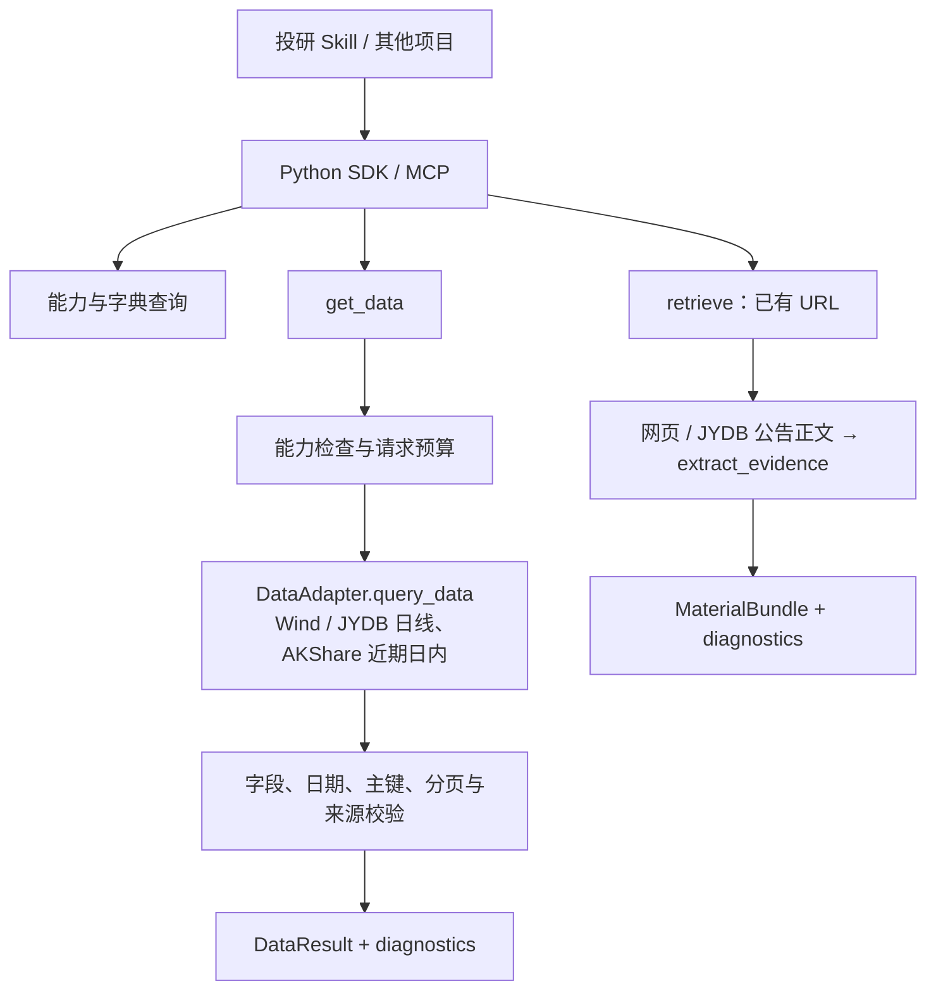

# 最小框架：已实现能力与 Adapter 接入约定

> 历史设计记录：本文的阶段状态和默认来源描述对应当时版本。当前实现、用户选源规则和待测试事项以 [HANDOFF](../HANDOFF.md) 及[能力清单](current_capabilities.md)为准。

实现日期：2026-09-13。对应[改进计划书](ir_search_v2_refactor_plan.md)的最小框架工作。随后已实现首批 Wind/JYDB adapters，配置与当前限制见 [接入说明](wind_jydb_adapters.md)，真实账户样本仍待验证。

## 当前能做什么

| 能力 | 当前行为 |
|---|---|
| `DataRequest` / `DataPage` / `DataResult` | 独立于搜索 Hit 的数据契约；日期、字段、市场、复权、分页、完整性和来源显式返回 |
| `MaterialRequest` / `MaterialBundle` | 接收 1–10 个已有 URL 或 JYDB 公告记录引用，读取正文和证据片段；返回来源、日期和缺口 |
| `DataRegistry` | 按 provider × dataset × account_scope 注册；声明与在线验证分开 |
| `list_capabilities` / `describe_dataset` | 无网络地查看注册声明和数据字典；定义存在不代表来源可用 |
| `get_data` | 选择一个符合要求的来源，读取并验证一页；不使用 URL 去重，不自动换源，不进行模型调用 |
| `RequestContext` | 每请求独立的账户标签、请求 ID、时间预算、操作次数预算和取消状态 |
| SDK / MCP | 框架四个工具，另加 search_announcements；原有六个工具和搜索调用保持兼容 |
| `AdvisoryResult` | 只预留生成观点的结果类型，`generated` 固定为 true；没有启用咨询执行 |

**未启用任何来源配置时，数值数据 registry 为空。** Wind MySQL 启用后注册证券信息和日行情；JYDB 启用后注册 A 股日线；AKShare 启用后注册沪深 A 股近期分钟数据。本地 env 已补充无需 Key 的 AKShare 开关；缺少可选 SDK 时查询返回 `dependency_missing`。Tushare、Longbridge 等仍走原来的搜索 adapters，没有被自动转换。无匹配 provider 时 get_data 返回 `unavailable` 和诊断，不会返回 mock 数据或把无来源当零结果成功。

retrieve 要求调用方提供 URL 或 search_announcements 返回的 JYDB 记录引用。也可以先通过原有 search 获取并检查来源和诊断，再把选中的链接交给 retrieve。Wind/JYDB 的集中 env 解析已实现；自动检索编排、持久化/缓存、在线能力探测、增量同步和长期版本管理仍未实现。

## 调用结构



## SDK 示例

查看字典及已注册能力不触发外部接口，也不读取 Key：

```python
from ir_search import DataRequest, describe_dataset, get_data, list_capabilities

catalog = list_capabilities()
definition = describe_dataset("prices_daily")

result = get_data(DataRequest(
    dataset="prices_daily",
    symbols=["000001.SZ"],
    start="2026-09-01",
    end="2026-09-10",
    fields=["close", "volume"],
    market="A_SHARE",
    adjustment="raw",
))
payload = result.to_dict()
# 当前默认结果：unavailable；diagnostics 包含 no_data_provider_registered。
```

以下函数接收调用方已经选择的实际资料链接；读取网络只在调用时发生：

```python
from ir_search import MaterialRequest, RequestContext, retrieve

def read_research_material(selected_urls):
    return retrieve(
        MaterialRequest(
            question="公司的收入增长与现金流情况有哪些证据？",
            urls=selected_urls,
        ),
        context=RequestContext(timeout_seconds=30, max_operations=5),
    ).to_dict()
```

SDK 无须 MCP extra。MCP 继续通过 `python -m ir_search.mcp_server` 启动，运行环境需要 `mcp` extra 及其支持的 Python 版本。当前 FastMCP 实现对应 MCP Python SDK 1.x，因此依赖限定为 `mcp>=1,<2`；2.x 已变更服务器接口，升级需单独迁移。[官方迁移说明](https://py.sdk.modelcontextprotocol.io/v2/migration/#fastmcp-renamed-to-mcpserver) 数据契约本身兼容项目声明的 Python 3.9+。

## 首批数据字典

| dataset | 主键 | 默认频率/口径 | 字段与约束 |
|---|---|---|---|
| `securities` | symbol | snapshot / none | symbol、name、market、exchange、currency；可选 available_at；日期区间不适用 |
| `prices_daily` | symbol + trade_date | 1d / raw | OHLC、volume、amount、currency；可选 available_at；必须提供证券与明确日期区间 |
| `prices_intraday` | symbol + bar_time | 1m / raw | 沪深 A 股近期分钟 OHLCV、trade_date、amount、currency；日期范围必填；覆盖未验收时始终 partial |

- symbol 必须包含上市地点，例如 `000001.SZ`；当前是规范化代码，跨代码变更的永久证券标识映射留待后续。
- 价格、成交额按每行 currency 标注；volume 为股数，不是手数。供应商转换由 adapter 完成。
- 省略 fields 时请求该数据集全部标准字段，available_at 除外。指定 fields 时仍必须返回主键和 currency。
- 不把缺字段默认为零。可空数值必须显式为 null；NaN/Infinity、数值列中的字符串或 bool 被拒绝。
- SDK 内支持 Decimal；JSON 中 Decimal 用字符串保留精度，普通整数/有限浮点数维持数值类型。
- 两个不同日期的记录保留为两行；重复主键会报 `invalid_provider_response`，不会挑一行静默覆盖。
- 未请求的证券、区间外记录、未知列、返回行数超过 limit 或错误的分页状态被拒绝。
- 当前三个数据集只支持实际值。财务、衍生品、基金、预测和因子字典将在对应 adapters 更新时增加。

## 下一步如何接入 DataAdapter

协议定义位于 `ir_search/registry.py`：

```python
class DataAdapter(Protocol):
    name: str
    capabilities: tuple[DataCapability, ...]

    def query_data(self, request: DataRequest, *, context: RequestContext) -> DataPage:
        ...
```

每个来源完成以下步骤：

1. 声明具体数据集、字段、市场、频率、复权、历史范围、分页与 as_of 能力。mode 不得默认为 live；真实实现和测试模式明确区分。
2. 将原始返回映射为标准字段，保留每页原始记录数量，明确单位与实际覆盖。
3. 返回 DataPage，包含 Provenance、complete、next_cursor 和逐操作诊断。complete 表示整个请求已完整覆盖，不只是“本页请求成功”；无法保证完整时返回 false。
4. 将凭证保留在来源 client 内，使用 RequestContext 的账户范围和剩余时间，避免修改全局环境或代理。account_scope 只是本地路由标签，不是授权凭证。
5. 使用 `DataAdapterError` 的稳定错误码报告权限不足、缺凭证、额度、限流、网络、超时、不支持或返回格式问题，不传递原始异常文本。
6. 先通过独立 DataRegistry 注册并执行契约/业务样本测试，再将来源加入 `build_data_registry()` 这个默认组装入口。

单独注入 registry 的调用方式：

```python
from ir_search import DataRegistry, get_data

def query_with_adapter(adapter, request):
    registry = DataRegistry()
    registry.register(adapter)
    return get_data(request, registry=registry)
```

registry 注册是原子的；同 provider/dataset/account_scope 重复注册会拒绝。不同账户范围不互相展示或路由。capability 中的 verified_at/access 来自注册方声明，目录查询本身不执行登录或权限验证。

默认 registry 现按[市场数据来源规则](market_data_source_policy.md)选源：A 股日线 Wind → 缺失时 JYDB，近期日内 AKShare；历史日内来源留空。`request.provider` 会锁定来源，禁止自动切换；没有合并多个来源的数据行/字段。手工 `DataRegistry()` 保留按名称排序的中性行为；需要项目规则时使用 `DataRegistry(use_source_policy=True)`。能力目录单列 `source_policy`，预留规划不等于已实现能力。

## 分页、时点与部分结果

- 每次 get_data 只取一页，最多 5000 行。后续页必须固定 provider，并原样保留原请求参数、附带返回 cursor；此版不自动遍历全部页面。
- 存在 next_cursor 时 complete 必须为 false，且来源必须声明分页能力。不会把第一页当作整个数据集。
- complete=false 或含失败诊断时返回 partial；`allow_partial=false` 时不交付不完整记录，也不返回可跳过这些记录的下一页游标。
- 只有来源声明支持 as_of，且每条记录都有不晚于该时点的 available_at，才接受带 as_of 的结果。缺少可得时间不会被当作历史安全数据。
- 普通请求不代表 point-in-time 保证。证券代码映射历史、财务重述、复权版本等仍需要未来来源的业务验证。
- complete 表示来源报告的记录/分页覆盖，经框架检查后保留；它不代表每个数值非空或已完成独立跨源核验。null 数值仍需调用方按字段定义处理。
- `access=denied` 在请求前拦截；unknown 可以尝试调用，但返回 `access_not_preverified` 提示，实际拒绝通过 typed error 保留。

## 素材与诊断边界

- 复用现有 HTML/PDF/文本读取能力；来源分类质量随当前提取器，未知原始发布者明确为 unknown，不从网页域名冒认作者。
- 原文、OCR、搜索摘要和生成文本分别标注。生成内容按观点处理，mock/placeholder/fallback 文档被拦截。
- 缺发布日期、文本截断、提取告警、没有相关片段或某 URL 失败，均使相应缺口可见；一个 URL 的处理错误不隐藏其他 URL 的成果。
- 证据跨度保留 doc_id、URL、字符位置及已有提取器支持的页码/章节。原始内容始终是 untrusted source text。
- 沿用现有 URL 与重定向限制；额外拒绝 URL 中的用户密码及常见认证参数。授权私域来源以后通过其专用 client 接入。
- adapter 异常不直接转发；来源诊断保留稳定 code/failure_kind，自由文本被换为安全标记，避免原始错误携带凭证。网页正文仍作为用户请求的源内容保留。

## 预算的实际保证

RequestContext 提供的是**协作式预算**：发起操作前与结束后检查取消/期限，超过预算不再启动后续操作，也不接受迟到的数据页；素材链保留此前已完成结果。

它不强行中止正在阻塞的第三方 SDK/系统调用。现有 URL 读取器的 timeout 传至 I/O，但重定向、多次读取和 CPU 提取仍可能超过总时间；下一步 adapters 必须传播剩余时间并在分页间检查。max_operations 当前计数服务操作，不声称精确计数来源 client 内部全部 HTTP 请求。

## 验证覆盖

新增测试覆盖严格序列化、跨日期记录、能力不匹配、账户范围、重复注册、分页、历史可得时间、部分失败、凭证不回显、取消/超时、素材引用、旧调用兼容和 MCP 实际注册列表。

本次另外在临时 Python 3.12 环境中运行了 110 项框架测试，包含 MCP 1.30.0 的实际工具注册与调用；构建 wheel 后，在仓库目录之外验证了安装包的 SDK 导入、10 个 MCP 工具注册，以及无数据源时的明确诊断。临时环境与现有 Python 环境隔离。

离线测试中的上游返回均为测试替身，只用于契约验证。它们没有被加入默认 registry，也不证明用户的数据源授权或在线业务可用性。后续 adapters 阶段需要单独记录真实小样本与权限验证结果。
