# Personal Information Flow & Research Brain 项目计划书

> 版本：v0.1
> 日期：2026-07-18
> 状态：方案评审稿
> 项目定位：个人使用、本地优先、证据驱动、可持续演进的研究信息流与知识系统

## 1. 执行摘要

本项目不是一个“自动把所有内容塞进笔记”的采集器，而是一套个人研究基础设施：它接收来自知识星球、IMA、财经网站、研究报告、微信公众号、微信视频、Bilibili、YouTube、聊天文件、邮件和其他网络软件的信息；保留原始来源及处理诊断；按六小时窗口增量归纳、去重、聚类和排序；把关键变化推送到手机；再将有价值的信息逐步沉淀为可检索、可验证、可更新的个人知识与研究判断。

项目的核心产品承诺是：

> 系统的通用性由统一入口契约实现，而不是靠无止境地为每个 App 编写专用爬虫。任何信息先可靠进入 Flow，再按能力分级解析、验证和晋升为知识。

建议产品形态是“本地核心引擎 + 多个轻入口 + 薄插件”，而不是第一阶段开发独立原生手机 App：

- `ir-search` 扩展为本地事实源、处理引擎和调度器。
- 手机通过系统分享、快捷指令、轻量上传页/PWA、邮件或飞书应用 Bot 投递。
- Obsidian 是主要阅读、研究和知识维护界面，但不是原始数据库。
- Codex 插件只负责配置、触发、检查状态和研究交互，不承载事实数据。
- 飞书优先承担通知；微信侧首版使用“用户主动分享进系统”，不逆向个人微信协议。
- 只有当两周以上真实使用证明分享路径仍是主要摩擦，才评估独立 App 或原生 Share Extension。

### 1.1 三层产品承诺

“任何软件/文件都能进入系统”必须拆成三个可验收的承诺：

1. **Acceptance guarantee**：任何 URL、文本或文件都能获得 `capture_id`，并被持久化或得到明确拒绝原因。
2. **Traceability guarantee**：每次输入都有来源、时间、内容 hash、隐私级别、处理状态和失败诊断。
3. **Understanding guarantee**：只有支持矩阵内的格式承诺完整解析；其他内容进入 `received_unparsed`、`needs_auth` 或 `quarantined`，保留后续回放能力，绝不静默丢失。

### 1.2 建议交付节奏

- 可演示原型：2–3 周。
- 可日常使用的 MVP：约 9–13 人周工程量。
- 1 名资深 Python/data 工程师：约 10–14 个日历周，含两周 shadow run。
- 2 名工程师并行：约 6–8 个日历周，含两周 shadow run。
- IMA、微信登录态和其他非标准来源另留约 20% 不确定性缓冲。

## 2. 背景与问题定义

用户面对的不是“信息不足”，而是以下五个连续问题：

1. **入口分散**：微信文章、视频、聊天文件、知识星球、IMA、研报、网页和视频平台各自封闭。
2. **保存摩擦**：看到内容时如果需要复杂操作，重要信息往往不会被保存。
3. **信息重复**：同一新闻、研报观点或“小作文”会被多次转载，制造虚假的信息量和多源印证。
4. **摘要失真**：若摘要脱离原文、页码、时间戳和来源层级，很快会变成不可验证的二手观点。
5. **知识不晋升**：信息即使进入笔记，也常停留在“收藏”，没有转化成事件、主张、论点、项目和决策记录。

因此系统需要同时处理两条链路：

- **Information Flow**：捕获、归一化、去重、事件化、六小时摘要与推送。
- **Research Memory**：证据、Claim、Thesis、项目、决策、复盘和过时知识更新。

仅完成第一条链路会产生一个更整齐的“稍后读”；本项目的长期价值来自第二条链路。

## 3. 项目目标与成功定义

### 3.1 产品目标

1. 在手机或电脑上，用一次分享、一次转发或一次拖放完成信息捕获。
2. 每六小时形成一份“发生了什么变化”的增量 Digest，而不是重复全文摘要。
3. 同一内容只保存一份，但每次捕获的时间、渠道、发送者线索、用户备注和研究意图都保留。
4. 所有事实性摘要都能回到原始 URL、文件、页码、段落或视频时间戳。
5. 明确区分官方资料、公司披露、研报、媒体、社交内容、小作文和个人判断。
6. 将高价值事件晋升为可验证 Claim，再由用户决定是否进入 Thesis、项目或决策。
7. 私密、付费和受限材料默认本地处理，不因推送或模型调用泄露。
8. 任一来源失败、登录过期、解析降级或补抓缺口都显式可见。

### 3.2 核心成功指标

| 维度 | MVP 目标 |
|---|---|
| 静默丢失 | 0 |
| 标准 URL/文本/文件入口合同测试 | 100% 通过 |
| 精确重复残留 | 0 |
| 近重复标注集 | Precision ≥97%，Recall ≥90% |
| Digest 重复项 | <3% |
| 事实性 bullet 可追溯率 | 100% |
| 人工抽检忠实度 | ≥95%，伪造来源/日期为 0 |
| 六小时窗口新鲜度 | p95 <7 小时 |
| 投递成功率 | ≥99%，重试后重复推送为 0 |
| Top N 用户“有用/值得保留”率 | ≥60% |
| 私密内容越界、secret 入库/日志 | 0 |

## 4. 产品边界

### 4.1 MVP 范围

MVP 包含：

- URL、文本、选区、截图和任意文件的统一 Intake Gateway。
- CLI/MCP、watched folder、鉴权 webhook、手机轻入口和浏览器主动保存。
- 可选 Intake 邮箱与飞书应用 Bot 入站。
- 知识星球、RSS/网页、本地研报目录等首批自动来源。
- IMA 的能力验证与可回退的主动保存路径。
- 原始文件/blob 存储、SQLite 状态、游标、outbox、重试和回放。
- URL/文本/PDF/Office/图片等支持矩阵内的抽取。
- 精确去重、近重复候选、事件聚类、来源分级和冲突提示。
- 每六小时 Digest、Obsidian 单向投影和飞书通知。
- 保存、忽略、静音、关注、关联项目、支持/反驳 Thesis 等反馈。
- 完整 diagnostics、隐私策略、备份恢复与两周 shadow run。

### 4.2 明确非目标

MVP 不包含：

- 不绕过登录、付费墙、DRM、反爬、平台授权或内容版权限制。
- 不逆向个人微信协议，不读取微信聊天数据库，不做个人微信 hook。
- 不承诺自动导入全部浏览/观看历史；首版以主动分享和明确 watchlist 为主。
- 不保证理解任意二进制格式；但必须接收、保留并报告状态。
- 不开发多租户 SaaS、社交协作、原生 iOS/Android App 或 App Store 上架。
- 不做自动投资结论或交易；模型摘要不是证据。
- 不自动修改用户手工 Thesis、项目笔记或决策记录。
- 不公开传播付费研报、私密群内容或聊天文件全文。
- 不把浏览器 DOM 抓取当 IMA 等来源的长期主链路。
- 不在第一版追求实时全网监控或完美知识图谱。

## 5. 关键设计原则

1. **Capture 与 Content 分离**：同一链接保存三次，内容只存一份，但三次用户意图都保留。
2. **传输与解析解耦**：Share、Webhook、Email、Folder、Poller 都只产生同一 Envelope；HTML、PDF、Office、OCR、Transcript extractor 只按内容工作。
3. **原始证据不可变**：改稿、撤稿和新版本建立 revision，不覆盖旧证据。
4. **所有失败可见**：`no_new_content`、`auth_expired`、`source_failed`、`unsupported` 不能混为一谈。
5. **本地优先**：SQLite、raw evidence 和附件是机器事实源；私密内容默认不离开本机。
6. **Obsidian 是投影层**：它服务于阅读和思考，不承担队列、幂等、游标和事务。
7. **机器建议、人做判断**：Source→Event 可以自动；Claim 只能自动提出；Thesis 和决策必须由用户确认。
8. **确定性链路优先**：鉴权、持久化、hash、MIME、精确去重、游标和 outbox 不依赖 LLM。
9. **模型输出有边界**：语义聚类、摘要和 Claim 建议在下游异步运行，必须绑定 EvidenceSpan 和 diagnostics。
10. **一个事实源、单向投影**：第一版不做 SQLite、IMA、Obsidian 之间的双向同步。

## 6. 典型用户旅程

### 6.1 微信文章

1. 用户在微信中点击“复制链接”或系统分享。
2. 选择 Flow 快捷指令/上传页，附一句“为什么保存”及项目标签。
3. Gateway 立即返回 `capture_id`。
4. 系统规范化 URL、抓取可访问正文并保留原链接；若需要登录，状态为 `needs_auth`。
5. 与已有转载、改稿或同主题来源比较。
6. 下一期 Digest 显示新增变化、来源层级、用户备注和原文入口。

### 6.2 微信视频或聊天中的视频

有三种合规路径：

- 视频有公开分享链接：保存链接，提取可获得的元数据/字幕。
- 用户合法拥有视频文件：显式保存到 Flow Inbox 或上传；系统先隔离，再按策略提取音轨和转写。
- 内容不可导出或需要登录：只保存链接、截图、用户备注与 `needs_auth` 状态，不伪造视频内容。

首版不自动读取个人微信内部媒体缓存，也不尝试绕过访问限制。

### 6.3 别人转来的文件

1. 用户将 PDF、Word、PPT、Excel、图片、音频或其他文件保存至 watched folder，或发给飞书 Intake Bot/上传页。
2. Gateway 校验真实 MIME、大小、hash 和路径；原件进入 quarantine。
3. 支持格式进入受限 extractor；不支持、加密或风险文件保留原件并给出原因。
4. 系统保存发送渠道、捕获时间、发送者线索、权限和用户备注。
5. 相同文件再次出现时复用 blob，但新增 capture occurrence。

### 6.4 YouTube / Bilibili 视频

- 主动保存：复制链接或分享到 Flow，并记录时间戳/选区/备注。
- YouTube：可用私人 `Research Inbox` 播放列表或订阅作为官方增量入口；不要把观看历史 API 当作可靠的六小时来源。
- Bilibili：首版以主动分享和公开页面为主；没有稳定官方能力时不依赖内部 cookie API。
- 字幕不可获得时不生成假摘要；可保存元数据并提示用户上传合法字幕/个人笔记。

### 6.5 知识星球、IMA 与固定财经来源

1. 配置 connector、权限、频率、隐私级别和初始 cursor。
2. 第一次运行只建立 baseline，默认不把全部历史当新信息推送。
3. 每轮按 cursor 增量抓取；登录失效和权限不足明确报告。
4. IMA 优先使用官方 API/导出能力；否则提供用户主动导出/保存路径。登录会话辅助抓取只作为受控降级方案。

### 6.6 从 Flow 晋升为研究判断

1. 用户对 Digest 项选择保存、忽略、关注 7/30 天或关联项目。
2. 多个独立 Source 聚合为 Event，并保留转载依赖关系。
3. 系统从 Event 提出原子 Claim Candidate，列出支持与反向证据。
4. 用户接受、拒绝或标记争议。
5. 已接受 Claims 由用户组织成 Thesis、研究备忘录或决策日志。
6. 新证据只提出 Thesis 更新建议，不静默改变原判断。

## 7. 总体架构

```mermaid
flowchart LR
    subgraph S["信息源与投递渠道"]
        A1["知识星球 / IMA / RSS / 财经网站"]
        A2["微信 / 飞书 / 邮件 / 其他网络软件"]
        A3["PDF / Office / 图片 / 音视频 / 截图"]
        A4["YouTube / Bilibili / 网页选区"]
    end

    subgraph I["Universal Intake Gateway"]
        B1["Auth / Rate limit / Receipt"]
        B2["Envelope / Capture Event"]
        B3["Quarantine / Blob Store"]
    end

    subgraph P["Flow Processing"]
        C1["Normalize / MIME / Fetch / Extract"]
        C2["Exact Dedupe / Revision"]
        C3["Near-Duplicate Suggestions / Event Clustering"]
        C4["Source Tier / EvidenceSpan / Claim Candidate"]
    end

    subgraph K["Canonical State"]
        D1["SQLite: cursor, runs, events, claims, outbox"]
        D2["Raw evidence + content-addressed blobs"]
    end

    subgraph O["输出与反馈"]
        E1["6-hour Digest"]
        E2["Obsidian Projection"]
        E3["飞书 / 邮件 / 合规微信渠道"]
        E4["Save / Ignore / Follow / Project / Thesis feedback"]
    end

    S --> I --> P --> K
    K --> O
    O --> K
```



### 7.1 部署建议

第一阶段采用 `local/private`：

- 一台固定 Mac 运行 worker、SQLite、blob store、scheduler 和 Obsidian projector。
- 手机通过私有 VPN/LAN HTTPS、同步 Inbox、邮件或官方长连接 Bot 投递。
- 所有抽取和证据保存默认在本机完成。

若飞书/企微等必须使用公网回调，再增加最小化 `hybrid relay`：

- relay 只验签、加密暂存和排队，不做抽取或模型处理。
- 本地 worker 拉取后删除，默认保留不超过 24–72 小时。
- relay 不保存永久凭证、全文证据或 Obsidian 数据。

## 8. Universal Intake Gateway

### 8.1 入口等级

| 等级 | 含义 | 例子 | MVP 策略 |
|---|---|---|---|
| A Native Sync | 有官方 API 或稳定导出，可增量同步 | RSS、部分财经 API、知识星球已授权能力 | 首批实现 |
| B Share Capture | 任意支持复制/系统分享的 App | 微信文章、视频链接、B站、YouTube | 首要通用入口 |
| C Drop Inbox | 用户显式投递的本地文件 | 研报、聊天附件、截图、录音 | 首批实现 |
| D Assisted Capture | 需登录且无正式 API 的页面 | IMA 登录页等 | 用户触发、受控降级 |

“任意 App 可进入”主要由 B/C 保证；它不等于每个 App 都能后台自动同步。

### 8.2 通道优先级

| 优先级 | 通道 | 用途 | 关键约束 |
|---|---|---|---|
| P0 | `flow add <URL|FILE>` CLI / MCP | 桌面、自动化、测试 | 统一协议的参考客户端 |
| P0 | Watched folder | 研报和聊天下载文件 | 拒绝 symlink/device；等待文件稳定 |
| P0 | `POST /v1/intakes` / multipart | 所有适配器的正式协议 | 必须鉴权、幂等、限流 |
| P0 | 手机上传页/PWA + 快捷指令 | URL、文本、截图、文件、备注 | 每设备独立 token |
| P0 | 浏览器主动保存模板 | 当前页、选区、备注 | 默认只读 active tab |
| P1 | Intake 邮箱 | 转发 newsletter、研报和附件 | OAuth、发件验证、MIME 安全 |
| P1 | 飞书应用 Bot | 收文本、URL、图片和文件 | 入站必须用可订阅消息事件的应用 Bot |
| P1 | 知识星球/RSS/Web/本地目录 connector | 自动增量信息源 | cursor、coverage、诊断 |
| P2 | IMA connector | 官方能力/导出优先 | DOM/session 仅辅助，不作长期主链路 |
| P2 | YouTube playlist/subscription | 主动收藏与订阅更新 | 不承诺 watch history |
| P2 | 企业微信应用/其他 webhook | 组织内消息和文件 | 官方验签与权限模型 |
| Later | 原生 Share Extension / App | 降低长期分享摩擦 | 真实使用数据证明有必要后再做 |

注意：飞书“群自定义机器人 webhook”主要是向群发消息，不能代替入站 Intake。接收用户消息和文件需要飞书自建应用 Bot、消息事件订阅、用户授权和相应权限。

### 8.3 统一 Intake Envelope

外层可兼容 CloudEvents 1.0，内部定义 `intake.capture.v1`。核心字段如下：

```json
{
  "specversion": "1.0",
  "id": "01J...",
  "type": "com.irsearch.intake.capture.v1",
  "time": "2026-07-18T00:00:00Z",
  "data": {
    "idempotency_key": "device-or-platform-event-id",
    "intent": "save",
    "captured_at": "2026-07-18T00:00:00Z",
    "origin": {
      "channel": "mobile_share",
      "origin_app": "wechat",
      "conversation_id": null,
      "message_id": null,
      "permalink": null
    },
    "parts": [
      {
        "part_id": "p1",
        "kind": "url",
        "url": "https://example.com/article",
        "title_hint": "...",
        "selected_text": "...",
        "user_note": "为什么值得保存"
      },
      {
        "part_id": "p2",
        "kind": "blob",
        "upload_id": "upl_...",
        "filename": "report.pdf",
        "media_type_claimed": "application/pdf",
        "size_bytes_claimed": 123456
      }
    ],
    "project_ids": ["project_..."],
    "topic_ids": ["topic_..."],
    "policy_hints": {
      "access_class": "private",
      "rights_class": "unknown",
      "allow_external_processing": false,
      "retention": "link_and_excerpt"
    }
  }
}
```

服务端必须自行生成或验证：

- `intake_id`、`received_at`、`principal_id`、`trace_id`。
- 实际 `size_bytes`、MIME、SHA-256 和安全状态。
- 认证是否成功、处理诊断和 retry 信息。

不得相信客户端声明的 MIME、hash、用户身份或权限；不得把 cookie、access token 或临时签名 URL 写入 Envelope、日志或 Obsidian。

### 8.4 Capture 与 Content 的关系

建议建立以下实体：

- `intake_event`：一次不可变的捕获行为，保存渠道、时间、意图和备注。
- `intake_part`：一次捕获中的 URL、文本或 blob，以及逐项状态。
- `blob`：内容寻址的原文件，按 SHA-256 复用。
- `content_object`：规范化 URL 或抽取后的内容对象，可被多个 capture 引用。
- `processing_attempt`：每个处理阶段的 adapter、错误、耗时、重试时间和 diagnostics。
- `projection_outbox`：Obsidian、Digest 和推送的可靠投递任务。

重复不是错误：同一 URL/文件带新备注、选区、项目或 `intent` 时，必须保留新的 capture relation。

### 8.5 Intake 状态机

```text
accepted_pending
  ├─ ready
  ├─ duplicate
  ├─ partial
  ├─ ready_with_warnings
  ├─ needs_auth
  ├─ needs_input
  ├─ quarantined
  ├─ rejected
  ├─ failed_retryable
  └─ failed_permanent
```

规则：

- 外部 callback 在 durable enqueue 后立即 ACK，不等待抓取、转写或摘要。
- 多 part 请求允许部分成功，并返回逐项 receipt。
- URL 抓取失败时仍保留用户保存的 URL 和备注。
- 聊天附件已过期时提示重新发送，不将其标记为“没有新内容”。
- 使用 at-least-once delivery + 幂等 consumer + 指数退避和 jitter。
- 超过重试上限进入 DLQ，可人工修复后 replay。

## 9. 文件、URL 与内容安全

### 9.1 默认配额建议

- 文本/选区：每 part ≤256 KiB。
- 用户备注：≤32 KiB。
- 每 event：≤20 parts。
- 单附件：默认 ≤100 MiB。
- 每 event 附件合计：默认 ≤250 MiB。
- 每个 principal 每日配额：默认 1 GiB，可配置。
- 大视频默认 `link-only`；用户自有媒体使用单独的本地导入 profile。

### 9.2 文件安全基线

- 不信扩展名和声明的 Content-Type，使用 magic bytes 和 parser 校验。
- 原件先进入 quarantine；下载时强制 attachment，不在浏览器内联执行。
- PDF、Office、HTML、图片和音频解析在无网络、低权限、限 CPU/内存/时长的环境中执行。
- 不执行 PDF JavaScript、Office 宏、嵌入文件或任何可执行程序。
- 压缩包、磁盘镜像、宏文档和可执行文件首版默认拒绝或隔离，不自动解压。
- 加密文件进入 `needs_input/password_required`；密码只在安全页面一次性使用，不写日志。
- 恶意软件扫描是附加信号，不能代替隔离和 parser sandbox。
- watched folder 只处理 root 内普通文件，拒绝 symlink、device、socket 和路径穿越。

### 9.3 URL 安全基线

- 仅允许 `http`/`https`。
- DNS 解析和每次重定向都阻止 loopback、RFC1918、link-local、云 metadata 和非标准协议。
- 限制重定向次数、响应字节、解压体积和请求时长，防止 SSRF 与资源耗尽。
- 原始 URL 与 canonical identity 分开保存；临时签名 query 需要脱敏。
- 外部网页、PDF、邮件和聊天文本均视为不可信数据，其中的“指令”不能调用工具或改变系统行为。

### 9.4 权限、版权与隐私

建议显式保存：

```text
rights_class: self_owned | licensed | third_party | unknown
access_class: public | login_required | paid | private | confidential
retention: link_only | link_and_excerpt | fulltext
processing: local_extract | local_embed | external_llm | digest_share
```

默认策略：

- 第三方/unknown：保留 URL、平台 ID、标题、用户备注、必要短摘录和派生摘要，不重分发全文。
- 付费研报、私密群、聊天文件：local-only；默认禁止外部模型和公开推送。
- `self_owned`/`licensed` 才默认允许完整抽取、长期全文和媒体处理。
- 推送私密材料时只给标题、用户备注、权限标签和本地/原平台入口。
- 删除或撤回保留 tombstone 和诊断，不假装原内容仍可访问。
- 原文、摘录、用户观点和模型摘要使用不同字段，全部绑定 provenance。

## 10. 支持格式矩阵

| 类型 | MVP 接收 | MVP 理解 | 默认处理 |
|---|---:|---:|---|
| URL / 纯文本 / Markdown | 是 | 是 | 规范化、抓取、正文抽取 |
| HTML / 网页归档 | 是 | 是 | 去脚本、保留原始快照与正文 |
| 文本型 PDF | 是 | 是 | 页码级 EvidenceSpan |
| 扫描 PDF / 图片 | 是 | 部分 | OCR；低置信度显式标记 |
| DOCX / PPTX / XLSX | 是 | 是/部分 | 结构化抽取，保留页/表/单元格定位 |
| CSV / TSV / JSON | 是 | 是 | schema/编码诊断后抽取 |
| 音频 | 是 | P1 | 本地转写、时间戳、说话人能力按配置 |
| 视频文件 | 是/受配额 | P1/P2 | 隔离；提取元数据、音轨和时间戳 |
| YouTube/B站/微信视频链接 | 是 | 取决于授权和字幕 | link-first；不可得时不猜测 |
| 压缩包 | 是/隔离 | 否 | 首版不自动解压 |
| 加密文件 | 是 | 需输入 | `needs_input` |
| 可执行文件/磁盘镜像 | 可拒绝并留 receipt | 否 | `quarantined` 或 `rejected` |
| 未知格式 | 是 | 否 | `received_unparsed`，等待未来 extractor 回放 |

## 11. Flow 处理与证据模型

### 11.1 处理阶段

```text
receive
→ authenticate
→ persist capture
→ quarantine/blob hash
→ normalize/fetch
→ extract
→ exact dedupe/revision
→ near-duplicate suggestions
→ event clustering
→ source/evidence classification
→ rank/summarize
→ digest/project/deliver
→ feedback/promote
```

每一阶段写入：`stage`、`status`、`adapter`、`started_at`、`finished_at`、`error_code`、`retry_at`、`diagnostics`。

### 11.2 精确去重

Gateway 只执行确定性去重：

1. Transport：`(channel, external_account_id, external_event_id)`。
2. Request：`(principal_id, idempotency_key)`。
3. Blob：streaming SHA-256。
4. URL：保留 original URL，同时建立规范化 identity。
5. Content：提取后的精确正文 hash。

URL identity 需要平台感知：

- YouTube：`video_id`。
- Bilibili：BV/AV ID + page。
- 微信文章：可用稳定文章标识组合；不得把临时登录参数当主键。
- 普通网页：移除已知 tracking 和 fragment，但不得破坏付费/签名 URL。

### 11.3 近重复与事件聚类

- SimHash、embedding 和语义模型只生成 merge suggestion，不在低置信度时直接合并。
- 事件聚类综合实体、时间、动作、数字、标题、引用来源和内容相似度。
- 优先降低 false merge：把两个不同事件合并，比暂时保留两个事件更危险。
- 同一稿件转载的来源属于同一 `independence_group`，不能虚增“多源验证”。
- 修改稿和撤稿建立 revision；旧版本不删除。
- 反向信息进入同一 Event 的 contradicting evidence，不被平均掉。

### 11.4 来源层级与证据类型

建议沿用现有 `ir-search` 的来源等级与 EvidenceSpan 结构，并明确展示：

- Tier A：监管、交易所、公司公告/IR、官方统计和原始文件。
- Tier B：高质量研究报告、官方采访、可定位的专业数据库或机构材料。
- Tier C：媒体、微信公众号、知识星球讨论、社交帖子和二次转述。
- Tier D：匿名“小作文”、无法验证截图、传言和来源不明内容。

Tier C/D 可以成为“需要验证的信号”，不能单独升级为已验证事实。Digest 必须明确标识“事实、引用、推断、传言、用户观点、模型摘要”。

### 11.5 排序

建议排序因素：

- 用户主动保存、备注和关联项目的强信号。
- 对 active project / Thesis 的相关性。
- 来源等级与证据完整性。
- 新颖性、变化幅度、时效性和市场重要性。
- 独立来源印证和反向证据。
- 用户过去的保存/忽略/静音反馈。

惩罚项：重复、转载依赖、标题党、来源不明、低抽取置信度和超过 attention budget。

## 12. 六小时 Digest

### 12.1 调度语义

六小时是“汇总与提醒节奏”，不是所有来源的统一抓取 SLA，也不是永久知识的更新节奏。

- 各 connector 按自身能力持续或分批抓取。
- Digest 使用固定、无重叠的 `[window_start, window_end)`。
- 建议默认时区为 `Asia/Shanghai`，时间点可设为 00:05、06:05、12:05、18:05；由用户配置最终时区。
- 电脑休眠或来源失败后按 watermark 补抓，late arrival 归入下一期并标明实际发布时间。
- 每个 run 保存 config hash、connector cursor、coverage、失败来源和输入快照。
- 没有高价值变化时允许发送“quiet digest”或不打扰通知，但仍生成 run record。

### 12.2 Digest 结构

每期建议最多呈现 Top 5–10 个变化：

```text
1. 本轮最重要的变化
2. 新事件 / 既有事件更新
3. 支持或反驳现有 Thesis 的证据
4. 用户主动保存但尚未处理的内容
5. 需要验证的小作文/传言
6. 待审阅 Claim Candidate
7. 来源异常、登录失效与覆盖缺口
8. 完整 Obsidian 入口与 run diagnostics
```

每个事实 bullet 至少包含：

- 一句话变化，而不是泛化摘要。
- 来源等级与 evidence type。
- 原始链接/文件定位，必要时包含页码或时间戳。
- 发布时间、捕获时间和 as-of。
- 新增、更新、反驳、撤回或重复状态。
- 置信度和关键限制。

### 12.3 推送策略

- 飞书首选：自定义机器人可做出站通知；若同时需要入站文件，使用应用 Bot。
- 邮件作为稳定 fallback 和完整 Digest 载体。
- 微信首版不操作个人账号；可评估合规的企业微信应用/机器人或用户已有的可信通知服务。
- 手机推送只放 Top N 和链接；完整证据、诊断和附件留在 Obsidian/本地系统。
- 所有渠道使用 outbox + delivery receipt，保证重试不重复。
- 支持一键静音来源、暂停全部推送和回放指定 run。

## 13. 从 Flow 到个人“大脑”

### 13.1 四层知识结构

| 层级 | 内容 | 更新方式 |
|---|---|---|
| Raw Evidence | 原始网页、文件、截图、字幕、捕获记录 | 只增 revision，不覆盖 |
| Flow / Event | 六小时变化、去重簇、事件时间线 | 自动增量 |
| Knowledge | Entity、Topic、Claim、概念和关系 | 自动建议 + 人工审阅 |
| Research / Decision | Thesis、项目、问题、决策、复盘 | 人工所有 |

### 13.2 晋升状态机

```text
Raw item
  └─ 规范化、抽取、去重成功 → Source

多个 Source 描述同一现实变化
  └─ 事件聚类 → Event

Event 中存在可复用、可定位的判断
  └─ 自动提出 → Claim Candidate (proposed)

Claim Candidate
  ├─ 人工接受 → accepted
  ├─ 证据冲突 → contested
  ├─ 证据不足 → watch
  └─ 人工拒绝 → rejected

Accepted Claims
  └─ 人工组织因果链 → Thesis / Project / Decision
```

硬规则：

- Event→Claim 只能自动生成 `proposed`。
- `accepted`/`rejected` 必须是显式审阅动作。
- Claim→Thesis 必须由人确认。
- 每次状态迁移保存操作者、时间、原因、证据和前后状态。
- 新证据可以提出 Thesis update proposal，但不得覆盖 Thesis 正文、conviction 和决策日志。

### 13.3 反馈动作

每条 Digest/Event 至少支持：

- `ignore`：本次无价值。
- `save`：进入长期知识候选。
- `follow_7d` / `follow_30d`：持续跟踪。
- `link_project`：关联研究项目。
- `support_thesis` / `contradict_thesis`：建立正反证据。
- `mute_source` / `lower_source_weight`：降低来源权重。
- `create_claim`：创建 Claim Candidate。
- `annotate`：保存“为什么重要”和个人判断。

## 14. Obsidian 工程方案

### 14.1 单向投影

```text
Raw evidence / SQLite
        ↓
Canonical Source / Event / Claim records
        ↓
Obsidian Projector
        ↓
Obsidian Vault
```

- SQLite、原始快照和事件版本是机器事实源。
- Projector 只执行 `Engine → Vault`，不监听整个 Vault 反向更新数据库。
- 人工反馈通过显式命令/API，或专用 Inbox 主动导入。
- 每个投影记录 `note_id → path → schema_version → content_hash → projected_at`。
- Projector 支持 `plan`、`diff`、`dry-run`、`apply`。
- 同一输入重复执行必须产生零文件差异。
- 不自动物理删除笔记；使用 `archived`、`retracted`、`superseded_by`。

### 14.2 Vault 目录

```text
Information Flow/
  00_Inbox/              # 人工投递；仅显式导入时读取
  01_Digests/            # 机器所有
  10_Sources/            # 机器所有
  20_Events/             # 机器所有
  30_Claims/Candidates/  # 机器生成，人工审阅
  40_Theses/             # 人工所有
  50_Entities/           # 机器生成，人工提交合并/更名请求
  60_Topics/             # 人工策展
  70_Annotations/        # 人工所有，通过 backlinks 关联
  80_Views/              # .base / 查询视图
  90_Templates/          # 版本控制
  99_Attachments/        # 机器所有，内容寻址
  _System/Schemas/       # schema 和受控枚举
```

机器 Event 文件不混合人工正文。用户评论写入 `70_Annotations/` 并链接 Event，避免手机编辑与定时投影争写同一文件。

### 14.3 Properties 与稳定性

- 使用扁平 YAML，避免嵌套 properties。
- 所有对象包含 `id`、`note_type`、`schema_version`、`created_at`、`updated_at`。
- 时间统一为带时区 ISO 8601。
- Properties 保存稳定 ID；正文渲染标准 Markdown/Obsidian links。
- 文件名基于稳定 ID，不因标题变化而重命名。
- 附件按 SHA-256 内容寻址。
- 原子写入、单 writer 文件锁；失败保留上一个完整版本。
- 写后校验 YAML、schema、内部链接和 attachment 引用。
- 密钥、cookie、token、webhook secret 不进入 Vault。

### 14.4 模板所有权

| 对象 | 机器权限 | 人工权限 |
|---|---|---|
| Digest | 创建不可变笔记 | 阅读、另建批注 |
| Source | 创建 revision，不修改旧版 | 另建批注 |
| Event | 创建和更新 | 通过 Annotation 评论 |
| Claim Candidate | 创建、补证、提出状态建议 | 接受、拒绝、标争议 |
| Thesis | 创建 scaffold/建议 | 唯一正文所有者 |
| Entity | 维护别名和关联 | 提交更名/合并请求 |
| Topic/MOC | 提供候选链接 | 人工策展 |
| Attachment | 内容寻址创建 | 不直接编辑机器原件 |

检测到人工修改机器文件时：不覆盖，标记 `projection_conflict`，生成 diff，并要求显式处理。

### 14.5 同步与备份

- 主 worker 固定写一份本地 Vault。
- 手机通过 Obsidian Sync 读取、搜索和编辑人工目录。
- 同一 Vault 只使用一种实时同步方案，不同时叠加 iCloud/Dropbox。
- 开启端到端加密，本地设备启用磁盘加密。
- 大型 PDF、音视频按 access policy 和 selective sync 控制。
- Git 版本化 Markdown、schema、template 和 `.base`；排除高频 workspace 状态及受限大文件。
- 另有完整 Vault、SQLite、raw evidence 和附件的本地快照与加密异地备份。
- Sync version history 和 File Recovery 不视为正式备份。
- 每季度在空目录执行恢复演练并验证 manifest hash。

## 15. 身份、鉴权与密钥

统一模型：`principal → channel identity mapping → scopes`。

最小 scope：`intake:create`、`blob:create`、`receipt:read`、`feedback:write`、`admin:diagnostics`。

| 通道 | 鉴权建议 |
|---|---|
| Web/PWA | Passkey/OIDC 或本地账号；Secure/HttpOnly/SameSite cookie、CSRF 防护 |
| 手机 Shortcut | 每设备独立高熵 token，存 Keychain/安全存储，可撤销、轮换、限流 |
| 浏览器扩展 | Device Code/PKCE，短期 token；默认仅 activeTab |
| Generic webhook | 每来源独立 secret；原始 body HMAC + timestamp + nonce 防重放 |
| 飞书应用 Bot | 官方 verification/signature/encrypt key；open_id/user_id allowlist；event_id 幂等 |
| 企业微信应用 | 验证 URL signature、CorpID、EncodingAESKey；userid 映射 principal |
| 邮件 | 随机专用地址 + sender allowlist；记录 SPF/DKIM/DMARC；优先 OAuth |
| Watched folder | 权限收紧的固定根目录；只处理稳定的普通文件 |

所有密钥进入 OS Keychain 或 secret manager，不进入仓库、Obsidian frontmatter 或日志。

## 16. 数据模型

建议新增以下 SQLite 表或等价实体：

| 表 | 作用 |
|---|---|
| `principals` / `channel_identities` | 单用户身份与各通道映射 |
| `source_definitions` | connector 配置、来源 tier、权限和 policy |
| `source_checkpoints` | cursor、watermark、最后成功时间 |
| `ingest_runs` | 每轮范围、配置 hash、coverage 和 diagnostics |
| `intake_events` | 不可变 capture 行为 |
| `intake_parts` | URL/text/blob 逐项状态 |
| `blobs` | SHA-256、实际 MIME、大小、quarantine 和存储位置 |
| `content_objects` | canonical URL/正文 identity |
| `source_items` / `revisions` | 标准化来源及版本链 |
| `evidence_spans` | 页码、段落、字符区间或时间戳定位 |
| `events` / `event_members` | 现实事件与来源成员 |
| `claims` / `claim_evidence` | Claim 状态与正反证据 |
| `entities` / `projects` / `theses` | 长期研究对象 |
| `digests` / `digest_items` | 六小时产物和排序解释 |
| `feedback` | 用户动作与人工判断 |
| `processing_attempts` | stage、错误、重试和 diagnostics |
| `outbox` / `delivery_receipts` | Obsidian 与消息可靠投递 |
| `projection_manifest` | note 路径、schema、hash、投影时间 |

所有新 MCP 工具返回 JSON 可序列化 dict；mock、placeholder、fallback 和 unsupported 状态必须显式可见。

## 17. 在 `ir-search` 中的工程结构

建议新增：

```text
ir_search/flow/
  models.py              # dataclasses、enums、Envelope、Receipt
  store.py               # SQLite、migrations、transactions
  blob_store.py          # content-addressed files、quarantine
  intake/
    service.py           # intake contract
    http.py              # uploads/intakes/status API
    cli.py                # flow add / status / replay
    watch_folder.py
  connectors/
    base.py               # probe/auth_check/poll/fetch/normalize/checkpoint
    zsxq.py
    rss.py
    web.py
    ima.py
    email.py
    feishu.py
    youtube.py
  extractors/
    html.py
    pdf.py
    office.py
    image.py
    media.py
  dedupe.py
  events.py
  ranking.py
  digest.py
  knowledge.py
  exporters/
    obsidian.py
  deliveries/
    feishu.py
    email.py
  scheduler.py
  diagnostics.py
```

Codex plugin 保持薄层，建议暴露：

- `flow.capture`
- `flow.run`
- `flow.status`
- `flow.digest.get`
- `flow.claim.review`
- `flow.project.link`
- `flow.diagnostics`
- `flow.replay`

插件不保存事实数据，不在插件缓存中复制凭证或全文附件。

## 18. 功能需求

| 编号 | 需求 |
|---|---|
| FR-001 | 接收 URL、文本和文件并返回 receipt/capture_id |
| FR-002 | 每个输入持久化来源、时间、hash、权限、隐私和 diagnostics |
| FR-003 | 同一幂等键或平台事件重放不创建重复 content |
| FR-004 | 同一 content 的新备注、选区和项目关系不丢失 |
| FR-005 | 支持 watched folder、CLI/MCP、HTTP、手机分享路径 |
| FR-006 | 首批 connector 支持 cursor、catch-up、auth health 和 coverage |
| FR-007 | 不支持/损坏/加密文件保留状态和原因，静默丢失为 0 |
| FR-008 | 原始证据、revision、EvidenceSpan 和来源 tier 可追溯 |
| FR-009 | 跨 run 精确去重、近重复候选和事件聚类 |
| FR-010 | 每六小时生成增量 Digest，展示来源异常和覆盖缺口 |
| FR-011 | Obsidian 投影幂等、可 dry-run、可重建、不覆盖人工区域 |
| FR-012 | 飞书/邮件 outbox 重试不重复推送 |
| FR-013 | 支持 save/ignore/follow/project/thesis/mute 等反馈 |
| FR-014 | Event 可提出 Claim Candidate，人工决定其状态 |
| FR-015 | 任一 run、connector、item 和 delivery 可审计与 replay |
| FR-016 | 私密/付费内容遵守本地处理和摘要投递策略 |

## 19. 非功能需求

- **可靠性**：durable enqueue、at-least-once、幂等、游标补抓、DLQ 和 replay。
- **确定性**：搜索热路径、hash、精确去重、run inputs 和证据链不依赖 LLM。
- **可审计性**：current-information 输出必须带 as-of、来源、coverage 和 diagnostics。
- **安全性**：最小权限、隔离、SSRF 防护、secret 管理和完整删除/保留策略。
- **隐私性**：本地优先；任何外部模型和外发摘要必须通过 access policy。
- **可移植性**：标准 Markdown、扁平 YAML、SQLite 导出、稳定 ID 和内容 hash。
- **可恢复性**：机器区可由数据库和证据仓完整重建。
- **可维护性**：connector/extractor 通过稳定接口解耦，失败不影响其他来源。
- **可观测性**：每阶段 JSON diagnostics，区分失败、降级、无新内容和过滤为空。

## 20. 里程碑与实施计划

### M0：合同、威胁模型与能力验证（0.5–1 人周）

交付物：

- Canonical Envelope、Receipt、状态机和错误码。
- SQLite schema、source/evidence enums、rights/privacy policy。
- 文件大小、MIME、SSRF、retention 和 auth scopes。
- URL、重复、超大、恶意 MIME、加密 PDF、partial batch 等 fixture corpus。
- 知识星球和 IMA capability spike；确认官方能力与降级路径。
- 首批来源清单、注意力预算和基线验收集。

退出条件：所有契约可以用 fixture 做离线、确定性合同测试；未知能力被标记为风险而非假设成功。

### M1：Universal Ingress 本地骨架（1.5–2 人周）

交付物：

- `/v1/uploads`、`/v1/intakes`、multipart、receipt/status。
- SQLite、content-addressed blob store、quarantine 和 processing attempts。
- CLI/MCP、watched folder、手机上传页/快捷指令模板。
- SHA-256、URL exact identity、幂等、配额和基础安全 fetch。
- Intake/Blob/Failure diagnostics。

退出条件：URL、文本和文件都能被可靠接收；同一请求重放不重复；不支持格式不丢失。

### M2：提取与首批来源（2–3 人周）

交付物：

- HTML、PDF、Office、图片抽取与 EvidenceSpan。
- 知识星球、RSS/Web、本地目录 connector。
- IMA 官方/导出路径或受控 assisted capture。
- cursor、baseline、catch-up、auth health 和 coverage reports。
- 浏览器主动保存；按优先级加入 Intake 邮箱/飞书入站。

退出条件：首批来源增量 fixture 覆盖 100%；每个失败可定位；电脑休眠后可补抓。

### M3：Flow、Digest 与交付（2–2.5 人周）

交付物：

- 跨 run 精确去重、revision、近重复候选和事件聚类。
- 来源独立性、tier、EvidenceSpan 和排序解释。
- 六小时 scheduler、Digest 模板、quiet digest。
- Obsidian Source/Digest/Event 投影与 manifest。
- 飞书/邮件 outbox、receipt、重试和去重推送。
- save/ignore/follow/mute/project 反馈。

退出条件：同一事件的多个来源只产生一个 Event；Digest 可追溯且投影/推送幂等。

### M4：知识闭环与硬化（2–3 人周）

交付物：

- Claim Candidate、正反证据、人工审阅和 Thesis scaffold。
- Annotation、Entity、Project 与 Bases/Views。
- sandbox extraction、完整 SSRF 测试、rate limit、token rotation。
- DLQ/replay、audit/delete、backup/restore 和 retention janitor。
- `rebuild-vault`、`audit-vault`、runbook 和故障注入测试。

退出条件：机器不能覆盖人工 Thesis；私密内容不越界；空目录可恢复全部机器区并通过 hash 校验。

### M5：两周 Shadow Run

前一周只写 receipt、SQLite 和 Obsidian，不发送主动通知；第二周可向测试群/个人频道发送预览。

每天观察：

- 重复和错聚/漏聚。
- Claim 证据定位错误。
- connector 漏抓、登录过期和补抓。
- projection conflict、断链和孤儿附件。
- 推送重复、失败和 attention budget。
- rights/privacy policy 和外部模型调用。
- Vault 增长、备份与恢复。

退出条件见第 23 节。

## 21. 工作分解与角色

### 21.1 建议角色

| 角色 | 主要责任 | 投入 |
|---|---|---|
| Product Owner（用户） | 来源优先级、隐私边界、200 条标注、每周评审 | 每周 2–3 小时 |
| Backend/Data Engineer | Gateway、SQLite、connectors、scheduler、evidence | 1 FTE |
| Integration/UX Engineer | PWA/分享、飞书、Obsidian projector、反馈 | 0.5–1 FTE |
| Security/Privacy Review | threat model、secret、文件与 SSRF 审核 | 里程碑审查 |

单人可以完成，但 Gateway、connector、Obsidian 和投递并行度较低；双人更适合在 6–8 周内交付。

### 21.2 成本类别

需要在 M0 选择并记录：

- 常驻 Mac 或小型服务器的运行成本。
- 可选公网 relay、域名、TLS 和对象存储。
- Obsidian Sync 或其他唯一同步方案。
- 邮件 provider/入站 webhook。
- 飞书/企微应用配置与组织权限。
- OCR、本地转写、embedding 和可选外部模型调用成本。
- 备份存储和加密异地副本。

默认优先本地开源能力；付费能力必须说明数据是否离开本机和单位成本。

## 22. 验收测试

### 22.1 入口与可靠性

| 用例 | 预期 |
|---|---|
| 同一 request/event 重放 | 不新增 content；返回同一或关联 receipt |
| 同一文件从微信下载目录和飞书 Bot 两次进入 | blob 只存一份，两个 capture 均保留 |
| 同一 URL 带新备注 | 不复制 Source，新增用户意图关系 |
| 文件上传中断 | 不产生 ready item；临时对象按策略清理 |
| 多 part 部分失败 | 成功 part 可用，失败 part 有独立状态和原因 |
| connector 429/timeout | 指数退避，cursor 不越过失败区间 |
| 电脑休眠超过一个窗口 | 唤醒后按 watermark 补抓，不重复推送 |
| Obsidian 不可写 | Intake 不丢；投影进入 outbox 重试 |

### 22.2 安全与隐私

| 用例 | 预期 |
|---|---|
| 扩展名伪装的可执行文件 | MIME 校验后 quarantine/reject |
| zip bomb / 路径穿越 / symlink | 拒绝且有安全诊断 |
| URL 指向 localhost/metadata | SSRF 规则阻止 |
| PDF/网页含“执行命令”文本 | 仅作为来源文本，不触发工具 |
| 付费研报进入系统 | 默认 local-only，不将全文发给外部模型/推送 |
| token/cookie/临时签名 URL | 不进入仓库、Vault 或普通日志 |
| 用户删除受限附件 | 按策略删除 blob，保留最小 tombstone/audit |

### 22.3 去重、证据与知识

| 用例 | 预期 |
|---|---|
| 同一 URL 带不同 tracking 参数 | 一个 canonical Source |
| 三家媒体转载同一材料 | 一个 independence group，不算三份独立证据 |
| 两条报道描述同一事件 | 一个 Event，保留全部 Source |
| 两个相似但不同事件 | 不自动错误合并；可保留 merge suggestion |
| 新来源反驳旧信息 | Event/Claim 标记 contested，旧证据不删除 |
| 来源改稿/撤稿 | 创建 revision/retracted 状态，旧链接仍可追溯 |
| Claim 自动生成 | 只能是 proposed，不能直接 accepted |
| 人工编辑 Thesis | 后续投影字节级不修改人工正文 |

### 22.4 Obsidian 与恢复

| 用例 | 预期 |
|---|---|
| 同一 run 连续投影两次 | 第二次零 diff、零重复笔记 |
| 投影中途崩溃 | Vault 保持旧完整状态，重跑可恢复 |
| Source 标题改变 | ID、路径和已有链接不变 |
| 人工修改机器 Source | 检测 conflict，不静默覆盖 |
| schema v1 升级 v2 | dry-run 显示差异，可从备份回滚 |
| 空目录灾难恢复 | Markdown、附件、SQLite、链接和 hash 全部匹配 |

## 23. Shadow Run 上线门槛

两周共 56 个六小时窗口，正式开推前建议全部满足：

- 至少 55/56 次自动成功；失败有诊断，下一轮自动补齐；连续 7 天无 P0/P1 故障。
- URL、文本、常见文件各完成至少 20 次入口样本；重复、损坏、超限和离线恢复场景全部通过。
- 每个自动来源至少人工对账 3 个时间窗；抽样漏抓率 ≤2%，静默漏抓为 0。
- 标注不少于 200 条 item，包含重复、改稿、转载和冲突，满足去重指标。
- 人工审阅不少于 100 条 Digest bullets：100% 可追溯，≥95% 忠实，伪造为 0。
- 重试后重复推送为 0；投递成功率 ≥99%。
- 无私密资料越界、无 secret 泄露、无未披露 fallback。
- 完成一次 SQLite + blob + Vault 的备份恢复和指定 run 回放。
- 平均每期通知不超过 attention budget；Top N 有用率 ≥60%；低价值批次可静默。
- runbook、来源权限清单、数据保留策略和一键停发/回滚可用。
- 用户明确确认隐私边界、Top N 质量和通知频率。

任何安全越界、无来源事实、数据丢失、静默失败或重复推送均为 hard blocker，不能以总体百分比豁免。

## 24. 运营指标

### 24.1 系统健康

- connector success/failure、auth expiry、cursor lag、coverage gap。
- ingestion latency、extract latency、Digest completion time。
- retry/DLQ、quarantine、unsupported、projection conflict。
- outbox age、delivery rate、duplicate delivery。
- storage growth、orphan blob、backup age、restore status。

### 24.2 信息质量

- 精确重复和近重复残留率。
- Event false merge / missed merge。
- Source independence 误判。
- EvidenceSpan 定位正确率。
- 摘要忠实度、冲突保留率和来源层级分布。

### 24.3 个人知识价值

- Digest save rate / ignore rate。
- 项目引用率和 Thesis 正反证据更新率。
- source yield：每个来源产生多少被保留内容。
- orphan notes：未关联项目/主题且长期未使用的比例。
- stale claim update latency：新反证出现后多久被发现。
- 决策/复盘中实际引用的 Evidence/Claim 数量。

不把“总收藏量”或“总笔记量”当成功指标。

## 25. 风险与缓解

| 风险 | 影响 | 缓解 |
|---|---|---|
| 微信/IMA 无稳定个人数据 API | 自动化覆盖有限 | 主动 Share/Drop 作为通用底座；官方导出优先；assisted capture 仅降级 |
| 登录/附件 URL 过期 | 内容抓取失败 | callback durable enqueue；及时下载；`needs_auth`/重发提示 |
| 近重复误合并 | 丢失事件差异 | exact dedupe 与 semantic suggestion 分开；高阈值；可拆分/回放 |
| 模型摘要失真 | 研究误导 | EvidenceSpan、事实/推断分栏、抽检、模型不进入确定性热路径 |
| 付费/私密材料泄露 | 法律与隐私风险 | local-only 默认、policy engine、推送短摘要、外部处理显式 opt-in |
| 恶意文件或网页 prompt injection | 设备/代理风险 | quarantine、sandbox、SSRF、防执行；来源文本永远是数据 |
| 过多通知造成疲劳 | 用户弃用 | Top N、quiet digest、attention budget、反馈驱动排序 |
| Obsidian 双向写冲突 | 人工内容丢失 | 单向投影、机器/人工目录分离、manifest 和 conflict 检测 |
| 单机休眠/故障 | 延迟或缺口 | watermark catch-up、健康检查、备份恢复；必要时迁移常驻设备 |
| 过早开发独立 App | 成本高且验证不足 | 先 PWA/Shortcut/Share 路径，基于真实摩擦决定是否原生化 |
| 来源越来越多导致维护失控 | connector 债务 | 统一 Envelope/adapter 合同、优先级和 source yield 淘汰机制 |

## 26. 开工前待决策项

以下决策不影响计划书成立，但 M0 必须落定：

1. 首批 5–10 个自动来源及其优先级。
2. Digest 最终时区、四个时间点和 Top N 数量。
3. Obsidian Vault 的实际路径、唯一同步方案与手机访问方式。
4. 手机首选入口：Shortcut/PWA、同步 Inbox、邮件还是飞书应用 Bot。
5. 首选推送渠道：飞书、邮件、企业微信或组合。
6. 单文件/单日配额和大视频处理策略。
7. raw、quarantine、失败项和付费材料的 retention 周期。
8. 哪些 access classes 可使用外部 LLM；默认建议全部关闭，逐类开启。
9. 公网入口是否必要；若必要，选择私有 VPN 还是最小化 relay。
10. IMA 首版采用官方 API、导出、手动分享或登录会话 assisted capture。
11. 是否允许保存完整付费研报，及对应授权和备份边界。
12. 用户每周可投入多少时间做标注、纠错和 Claim 审阅。

## 27. 推荐的首版决策

若立即启动，建议采用以下默认答案：

- 核心：继续扩展当前 `ir-search`，不另起一个孤立系统。
- 产品形态：本地引擎 + 手机轻入口 + Obsidian + 薄 Codex 插件。
- 手机入口：PWA/Shortcut 和 watched folder；飞书入站作为 P1。
- 推送：飞书优先，邮件 fallback；暂不自动操作个人微信。
- 来源：知识星球、RSS/财经网页、本地研报目录、主动分享的微信/视频链接；IMA 做 M0 spike。
- 数据：SQLite + content-addressed blob store 是 canonical source。
- 知识界面：Obsidian 单向投影，机器区与人工区分离。
- 时间：`Asia/Shanghai` 四个六小时窗口，可配置。
- 模型：先本地/确定性处理；外部模型按 access class 显式开启。
- 上线：先 shadow run，再打开主动通知。

## 28. Definition of Done

项目达到 V1 完成状态，必须同时满足：

- URL、文本和文件的统一入口可用，支持矩阵和失败语义有文档与合同测试。
- 所有 intake 有 receipt、来源、时间、hash、权限、状态和 diagnostics。
- 任一 connector 失败不会造成全局失败；cursor 可补抓和回放。
- 重复运行无副作用；相同 content 不重复，但用户的新意图不丢。
- 每个事实能回到 Source 与 EvidenceSpan；传言、模型摘要和用户观点不会冒充事实。
- Mock、placeholder、fallback、unsupported 和 coverage gap 全部显式可见。
- 六小时 Digest、Obsidian 投影和消息投递均幂等。
- Vault 可从引擎重建；机器不能覆盖人的 Thesis 和 Annotation。
- 私密/付费内容不越界，secret 不进入仓库、Vault 或日志。
- 备份恢复、DLQ replay、安全故障注入和两周 shadow run 通过。
- 仓库测试通过，新增 public function 有测试，行为变更有文档。

一句话验收：

> 任意信息可以低摩擦、无静默丢失地进入 Flow；重要变化每六小时可追溯地抵达用户；真正有价值的证据能晋升为知识和判断，而机器永远不替用户悄悄改写结论。

## 29. 参考资料

### 29.1 仓库内设计

- [Deep Research 设计](deep_research_design.md)
- [Evidence Schema](evidence_schema.md)
- [MCP Tools](mcp_tools.md)
- [Security Policy](security_policy.md)

### 29.2 官方平台资料

- [飞书机器人能力概览](https://open.feishu.cn/document/uAjLw4CM/ukTMukTMukTM/bot-v3/bot-overview)
- [飞书消息 API 与消息事件](https://open.feishu.cn/document/server-docs/im-v1/introduction?lang=zh-CN)
- [飞书获取消息中的文件](https://open.feishu.cn/document/server-docs/im-v1/message/get-2)
- [Obsidian 导入与本地 Markdown](https://obsidian.md/help/import)
- [Obsidian Properties](https://obsidian.md/help/properties)
- [Obsidian Bases](https://obsidian.md/help/bases)
- [Obsidian Web Clipper](https://obsidian.md/help/web-clipper)
- [Obsidian URI](https://help.obsidian.md/Extending%2BObsidian/Obsidian%2BURI)
- [Obsidian Sync 安全](https://obsidian.md/help/sync/security)
- [YouTube Subscriptions API](https://developers.google.com/youtube/v3/docs/subscriptions/list)
- [YouTube Playlists API 指南](https://developers.google.com/youtube/v3/guides/implementation/playlists)
- [YouTube Channels API](https://developers.google.com/youtube/v3/docs/channels)
- [YouTube Captions Download](https://developers.google.com/youtube/v3/docs/captions/download)
- [YouTube Push Notifications](https://developers.google.com/youtube/v3/guides/push_notifications)
- [Bilibili 开放平台](https://openhome.bilibili.com/doc)
- [微信软件许可及服务协议](https://weixin.qq.com/cgi-bin/readtemplate?head=true&lang=zh_CN&s=default&t=weixin_agreement)
