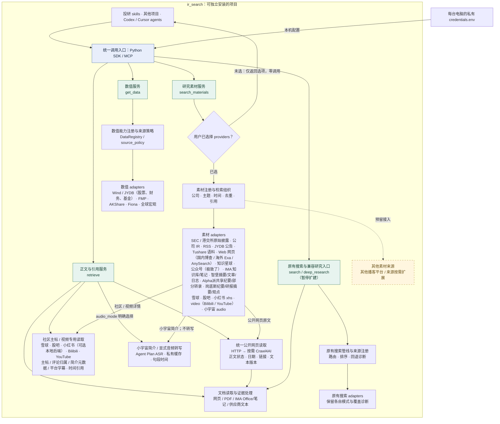
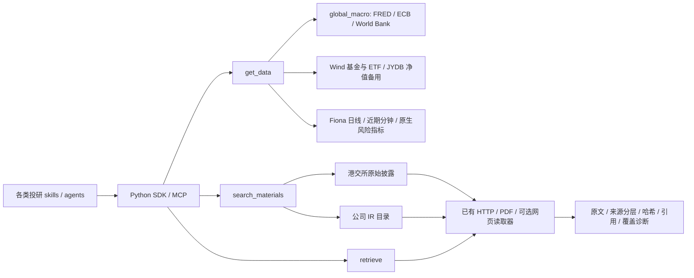

# ir_search 当前项目拓扑

依据 0.2.0rc1 / 2026-09-18 的代码结构绘制；交接状态见 [HANDOFF](../HANDOFF.md)。图中实线表示已有调用或配置关系，虚线表示待接入能力；adapter 内部实现暂不展开。已有代码不等于所有数据品类、账号权限和来源覆盖都已验收，具体以调用诊断为准。

图表示模块关系，各调用的结果沿调用链返回给 skills / agent；没有画出额外的“统一结果总线”。数值和素材分别使用适合自身的数据契约。

## 各层职责

| 层次 | 职责 | 对应代码 |
|---|---|---|
| 调用方 | 定义研究问题、时间范围、指标口径，并根据证据形成分析 | 外部 skills、其他项目和 agents；不属于本仓库运行依赖 |
| SDK / MCP | 提供稳定调用入口；agent 也可查询能力与状态 | `ir_search/__init__.py`、`ir_search/mcp_server.py` |
| 数值服务 | 字段与请求校验、数据源选择、整次请求回退、口径和完整性诊断 | `ir_search/services/data.py`、`ir_search/registry.py`、`ir_search/source_policy.py` |
| 素材服务 | 区分内容类型和渠道、发布日期和业务期间；按公司及主题查找、归组并提供引用 | `ir_search/services/material_search.py`、`ir_search/material_registry.py` |
| 文档与证据 | 显式地址读取、文本提取、证据片段及规则核验；保留读取失败和截断说明 | `ir_search/services/retrieval.py`、`ir_search/documents/`、`ir_search/evidence/` |
| 既有研究编排 | 维持旧调用兼容；deep_research 暂停扩建，继续使用原有搜索和研究结果骨架 | `ir_search/kernel.py`、`ir_search/pipeline.py`、`ir_search/research/` |
| adapters | 将不同来源转换成各自服务要求的接口，保留供应商身份和错误诊断 | `ir_search/adapters/`，部分客户端位于 `ir_search/clients/`、`ir_search/infrastructure/` |
| 支撑组件 | 数据契约、来源信息、请求预算与取消、连接配置、公司字典和检索规则 | `ir_search/contracts/`、`ir_search/context.py`、`ir_search/infrastructure/`、`ir_search/configs/`、`ir_search/entities/` |

`RequestContext` 的统一期限和操作预算用于新框架服务；原有搜索与研究编排仍有各自的预算和诊断机制，尚未全部迁移到这一请求模型。

## 图中简化的辅助入口

- `list_capabilities`：分别展示数值和素材能力；素材目录同时显示待接入来源。注册不等于账号权限或在线可用性已经核实。
- `describe_dataset`：查看数值数据集的字段与口径定义。
- `source_health`：查看来源模式、配置和已有健康诊断；不是持续运行的监控服务。
- `search_announcements`：现有 JYDB 公告元数据入口，仍直接调用 JYDB 公告实现。
- `fetch_document`、`extract_evidence`、`verify_claims`：文档与证据处理的独立调用入口。规则核验结果不替代调用方的研究判断。

## 当前需要保留的架构边界

1. **新素材入口与既有研究链路并行。** `deep_research` 进入兼容维护并暂停扩建，继续调用原有 `search`。新 skills 按需组合 `get_data`、`search_materials` 与 `retrieve`；当前不计划将新入口自动接入旧编排。复用取舍见 [deep_research 复用审查](deep_research_review.md)。
2. **来源协议按用途分开。** 数值使用 `DataRegistry`，新素材使用 `MaterialRegistry`，原有搜索保留自己的 registry；它们不是已经合并完成的单一来源注册中心。
3. **公开网页读取已统一，供应商保留专用分派。** `search_materials` 的网页 adapter 与 `retrieve` 共用 HTTP / 可选 Crawl4AI 读取层；`retrieve` 另有 JYDB、知识星球、公众号和 IMA 分派。统一读取层提供正文状态、文本哈希、引用校验和有界链接发现，见 [网页读取拓扑与接口](web_reader.md)。
4. **存在缓存组件，尚无统一素材检索库。** 原有文件缓存和 `DocumentStore` 已存在；新素材结果尚未自动写入持久化全文/向量索引。图中未把计划中的统一证据库标成已实现。
5. **研究判断由调用方承担。** 确定性搜索热路径不调用 LLM；材料内容始终作为不可信来源文本处理。数值记录、主题词命中、供应商转录和生成的研究判断分别标识。

当前数值路线为国内 EOD/核心财务 Wind → 缺失时 JYDB、海外已实现范围使用 FMP、近期日内使用 AKShare。新素材入口已接入 JYDB 公告、独立 Tushare 研报摘要/新闻/政策、公开网页 `web` 和知识星球 `zsxq`，实际扫描窗口与文本范围分别诊断。Tushare 直接解析供应商返回 HTML；网页按地区经国内博查或海外 Exa / AnySearch 发现链接，跨地区共享预算，再读取原站，区分搜索摘要、提取正文和未知日期，未接入旧研究编排。指南见 [Tushare 语料](tushare_corpus_adapter.md)、[网页素材](web_material_adapter.md)。知识星球通过官方 MCP 读取有限时间流和详情，发现附件并提供显式 PDF 读取，区分来源片段、作者角色与未知情况，见[知识星球素材指南](zsxq_material_adapter.md)。公众号 `wechat` 已接入账号池历史列表、原站读取和极致了正文补充读取，保留正文提供方、有限扫描及引用诊断，见[公众号素材指南](wechat_material_adapter.md)。IMA 已通过官方 OpenAPI 独立接入知识库/笔记搜索和授权原文读取，详见 [IMA 素材指南](ima_material_adapter.md)。Alpha派已以账号密码接入共享纪要、AI 摘要和部分机器转录，见 [Alpha派指南](alphapai_material_adapter.md)。

## 跨电脑使用

各电脑安装同一个 `ir_search` 包，通过 Python SDK 或 MCP 调用；分别提供私有 env 及可选的供应商依赖。运行代码和规则字典在包内，凭证和私人材料在包外。本拓扑不要求依赖开发者桌面的 BrokerSkills/skills 目录，也不表示已经部署了云端常驻服务或完成 GitHub 发布。

相关说明：[素材服务行为与验收](material_search.md)、[独立部署与迁移](standalone_deployment.md)、[MCP 工具目录](mcp_tools.md)。

2026-09-17：新增智堡独立 `wisburg` 素材 adapter，经官方 MCP 读取已存摘要、文章和日志；`retrieve` 分派 `wisburg://` 引用。摘要与原文、可能 AI 辅助整理与未经独立核验分别标记，详见[接入指南](wisburg_material_adapter.md)。未连接 legacy 研究编排。

## 机构与官网取材增强（2026-09-17）

已增加 14 条有出处的机构目录、显式官网范围 `web_institutions`、监管目录/附件识别、HTTP 正文有界并发 `web_read_workers` 和无网络执行预览 `dry_run`。目录随安装包分发，SDK 与 MCP 均可调用；详见[使用说明](material_hardening.md)。

2026-09-17 新增 `xueqiu`、`eastmoney`（股吧素材）和 `video`（Bilibili / YouTube）；它们按素材协议注册，详情读取使用专门的主帖/字幕提取器，不把整张平台页面当作正文。国内使用博查，YouTube 使用 AnySearch；视频字幕引用增加时间定位，简介只作为元数据。本机股吧正文链路通过，雪球和 Bilibili 受平台验证影响，YouTube 受本机 DNS 解析限制，字幕真实验收仍有缺口，见[验收记录](community_video_acceptance.md)。[本地参考资源库](reference_library.md)用于开发参考，不在运行时调用图中。

2026-09-17 音频更新：独立注册 `xiaoyuzhou` / `audio`，搜索仅取公开简介；`retrieve` 显式选择 Agent Plan 有界音频转写，保留机器转写标记、原音频哈希和句段时间。详见[配置与调用](xiaoyuzhou_audio_adapter.md)、[验收](xiaoyuzhou_audio_acceptance.md)。

2026-09-17：新增独立 `sec` 素材 adapter，通过 SEC submissions 查询 EDGAR 披露，`retrieve` 使用官方档案专用读取器，返回主文件文本、附件链接和引用。数值 FMP 与披露 SEC 分开，范围不等于全球交易所全覆盖，见 [SEC 指南](sec_filings_adapter.md)和[验收](sec_filings_acceptance.md)。

岗底斯已接入同一素材与引用入口，账号会话仅本地保存，独立于官方 AK/SK MCP。纪要与研报摘要不作为原文全文，见 [岗底斯指南](gangtise_material_adapter.md)。

## 宏观、基金、ETF、Fiona 与港股入口（2026-09-18）

图表示已实现路由，不是全部来源实时可用的承诺。宏观序列、份额类别、披露日期与金额口径见 [接口指南](expanded_adapters.md)；外部网络与样本限制见 [验收](expanded_adapters_acceptance.md)。国内原有 EOD 默认顺序及 `deep_research` 兼容边界保持不变。

当前网页额度耗尽会返回 `fallback_requests`，由调用方 Agent 执行原生 Web Search 后按预算调用 `retrieve`；服务端不直接执行宿主搜索。外部参考目录不是运行依赖，见[参考清单](external_references.md)。
