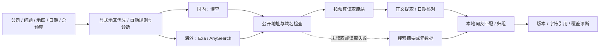

# 网页素材 adapter

2026-09-18：公开网页作为独立来源 `web` 接入 `search_materials` Python SDK/MCP，支持 **国内博查、海外 Exa 或 AnySearch** 的地区路由。发现链接后按预算读取原站，使用包内提取、匹配、归组和引用能力。明确额度耗尽时交接给调用方 Agent 的 Web Search，见[配置与接续规则](web_search_fallback.md)。此前博查/AnySearch 的真实 SDK/MCP 验收见[地区路由记录](web_regional_acceptance.md)，[首版网页验收](web_material_acceptance.md)保留为历史记录。

## 配置与调用

在各电脑自己的私有 env 中配置；异地启动时用 `IR_SEARCH_CREDENTIALS_FILE` 指向该文件。公共模板默认关闭。配置示例如下，密钥填在本机私有文件中。

```dotenv
WEB_MATERIALS_ENABLED=true
WEB_SEARCH_PROVIDER=regional
WEB_OVERSEAS_PROVIDER=exa
WEB_ALLOW_ANONYMOUS=false
WEB_ALLOWED_DOMAINS=
ANYSEARCH_API_KEY=
EXA_API_KEY=
BOCHA_API_KEY=
```

`BOCHA_API_KEY` 只发往博查的固定 HTTPS 搜索接口；`ANYSEARCH_API_KEY` 只发往 AnySearch 的固定 HTTPS 搜索接口。`EXA_API_KEY` 只发往 Exa 固定 HTTPS 搜索接口。各家凭证不混用，原站正文请求不携带搜索 Key。不会将鉴权失败自动降级为匿名、切换到另一市场引擎或注册新账户。

`WEB_SEARCH_PROVIDER=regional` 按请求地区选择引擎，海外通过 `WEB_OVERSEAS_PROVIDER=exa/anysearch` 选择，也支持固定 `bocha` / `anysearch` / `exa` 模式。为保持旧配置兼容，省略引擎字段仍采用 AnySearch，省略海外选择也沿用 AnySearch；公开新模板明确填写 `regional`。地区模式允许只配置一家，但缺少对应 Key 的路线返回 `no_credential`，不会借用另一家的 Key。只有显式 `WEB_ALLOW_ANONYMOUS=true` 且 AnySearch 没有 Key 时才允许其匿名调用，博查和 Exa 始终需要 Key。

`WEB_ALLOWED_DOMAINS` 可填写至多 10 个以逗号分隔的域名，例如 `gov.cn,microsoft.com`，同时允许其子域名。域名限制既进入搜索提示，也在原站读取及每次重定向时检查；空值表示不限定公开域名。

```python
from ir_search import MaterialSearchRequest, search_materials

result = search_materials(MaterialSearchRequest(
    question="智能家居消费政策",
    keywords=["智能家居"],
    published_start="2026-09-01",
    published_end="2026-09-15",
    providers=["web"],
    web_region="cn",
    material_types=["policy"],
    candidates_per_source=5,
    text_reads_per_source=3,
    max_chars=12000,
)).to_dict()
```

MCP 使用同名工具，直接传这些字段。目录 `list_capabilities().materials` 显示已配置能力；查看目录不发网络请求，也不代表在线验收通过。公司网页可不指定 `material_types`，或指定 `web_page`。显式 `providers=["web"]` 只检索网页；省略来源时返回选择提示，不调用任何来源；详见[用户选源契约](source_selection.md)。

## 地区选择

`web_region` 是 SDK/MCP 的可选字段，只作用于网页 adapter：

| 取值 | `regional` 模式的行为 |
|---|---|
| `cn` | 国内市场：博查 |
| `overseas` | 海外市场：配置的 Exa 或 AnySearch；本项目路由也将港股等境外上市市场归入此选项 |
| `both` | 两家各查询一次，共享候选和正文预算 |
| `auto`（默认） | 先检查证券代码、明确市场词和有限公司名称规则；中外信号并存时查询两家 |

例如“美国人工智能”“英伟达”虽用中文提问，也可路由到配置的海外引擎；“China artificial intelligence”路由到博查。明确指定地区优先于自动规则。规则无法识别时，中文默认国内、其余默认海外，并标记 `language_default_unverified`，不将语言作为已确认的市场归属。已知范围的投研 skill 应显式填写地区。固定引擎配置优先于地区映射，用于保留原有单供应商行为。

地区用于选择搜索引擎，并非对返回网站国别、内容市场或日期的强制过滤。跨市场检索不自动翻译问题，调用方可提供合适的双语关键词。

## 链路与出处



| 字段 | 含义 |
|---|---|
| `provenance.provider` / `channel` | 均为 `web`，表示本次接入来源和渠道 |
| `discovery_provider` | `bocha`、`exa` 或 `anysearch`，表示发现链接的搜索服务 |
| `coverage[].scans[]` | 逐引擎记录 `discovery_provider`、`web_region`、`routing_basis`、收到/检查数量及状态 |
| `provenance.publisher` | 实际网页域名；仅确认域名，不推断机构法定身份 |
| `source_ref` | 搜索返回的公开 URL |
| `original_url` | 读取成功后为最终网页 URL，可能与搜索 URL 不同 |
| `text_scope` | `metadata`、`abstract`、`search_snippet`、`source_excerpt`、`extracted_text` 五类；本 adapter 只产生元数据、搜索摘要和提取文本 |

只保留上游声明的标题、URL、搜索摘要、发布日期字段；Exa 的 `text` 仅用作搜索摘录，忽略任意扩展内容及生成的 `summary` / `answer`；博查请求 `summary=false`，不采用响应中的 `summary`，不把可能生成的答案当原文。原站读取成功后，以提取文本替换搜索摘要。未读或读取失败时，可以保留 `search_snippet`，同时标注 `snippet_origin_unverified`、`search_snippet_not_original_text`；无摘要则为 `metadata`。相同搜索摘要不会作为不同 URL 之间的合并依据。

引用的 `version_id` 和字符位置绑定本次实际返回的标题或文本；搜索摘要引用不等于原文引用。`coverage[].returned_evidence` 分别统计五种文本层级及引用数。正文截断时，内容哈希和引用仅覆盖取得的文本，调用方应保存结果供复核。素材服务目前仅输出字符位置，不凭空生成 PDF 页码。所有文本均为不可信来源内容，不作为 agent 指令执行。

## 范围、日期与分类

- 单地区最多一次搜索；双地区最多两次搜索，总计最多检查 10 条候选。候选与正文读取预算按国内、海外顺序均分，余数优先给国内；某路线分不到候选时，返回 `web_region_budget_exhausted`，不发请求。公共候选预算更大时仍受总计 10 条上限约束。不翻页或自动重试。实际发起的原站读取（含失败）消耗正文读取预算，重定向另消耗请求操作预算。
- 请求中的日期仅作为搜索文字提示；上游未证明提供日期筛选。`scans[].date_filter_basis=local_publication_metadata`，该行起止日期是本地过滤边界，不是已扫描整个窗口的证明。收到、检查、命中和最后返回的数量分别记录。
- 先读取原站再用可取得的发布日期做本地筛选。页面日期优先于搜索元数据，冲突可见；已知日期在范围外的材料剔除。日期未知的材料保留并警告，不能视为已确认在请求期间内。日期不会从 URL、摘要或抓取时间猜测。
- 没有时区的日期保留 `published_on`，不虚构精确 `published_at`。业务期间始终独立；发布于某月不证明讨论的是该月经营数据。
- 内容类型只注册 `web_page`、`news`、`policy`。政策使用中国政府域名加标题词规则；新闻使用有限媒体域名表；其余为未分类的 `web_page`。公司网页、海外新闻也可能归入 `web_page`，不自动认定为财报、研报或调研纪要。
- 政府原站正文的权威层级由域名推断并警告；这不证明政策效力。普通网页的证据类型和原文权威身份可为 unknown；搜索服务身份不会变成原发布者身份。

单家鉴权、权限或网络失败保留逐路线诊断，另一家成功结果可返回；所有子查询失败时为 `unavailable`、`source_queries_failed`，不报告成功空查询。同一 URL 被两家发现时保留两份发现记录，不视为独立事实佐证。请求总期限/取消仍可终止整次调用。

当某路线明确 `quota` 时，返回 `fallback_requests` 供 Agent 接续原生搜索并调用 `retrieve`；服务端尚未执行该搜索。普通限流或鉴权失败不触发。详见[接续契约](web_search_fallback.md)。

所有结果保持 `partial` 或 `unavailable`，`complete=false`；没有全网、全站或全期间完整覆盖承诺。

## 读取与稳定性边界

搜索仅调用固定的 `https://api.bochaai.com/v1/web-search`、`https://api.anysearch.com/v1/search` 或 `https://api.exa.ai/search`，不调用问答或生成模型接口。博查使用 `query/count/freshness/summary`，映射 `data.webPages.value` 中的 `name/url/snippet/datePublished`，不把 `dateLastCrawled` 当发布日期；接口依据[博查官方开放平台](https://open.bochaai.com/)。AnySearch 沿用 `query/max_results` 和 `data.results`，依据[AnySearch 官方接口文档](https://anysearch.com/docs/api-endpoints)。本地选择、匹配及引用均不引入 LLM。

公开网页读取使用标准库连接：检查域名解析结果，连接已检查的公网地址，HTTPS 验证证书和主机名；拒绝私网、携带凭证的 URL、非默认端口及 HTTPS 降级重定向。不使用浏览器登录态、环境代理、Cookie 或其他来源密钥。原站重定向最多 3 次，每次重新校验；公开 HTTP 页面可读取但带未加密警告。

单页下载最多 8 MiB、搜索响应最多 2 MiB；共用期限、取消与操作预算，读取期间主动检查并中断超时连接。DNS 解析及正文提取仍为协作式期限检查，不是可强制终止一切工作的硬期限。

支持 HTML、纯文本和可选 PyMuPDF 的文字 PDF；常见中文编码已覆盖。支持可选 Crawl4AI 渲染动态网页；不支持登录页面、OCR 或付费墙绕过。请求不压缩响应；上游仍返回压缩流或未支持编码时明确报错。可能取得含导航、表格残片的文本；提取成功不代表完整复原排版、财务表格或独立核实事实。

实现全部位于可安装包内，不依赖 Desktop、BrokerSkills 或旧研究编排。此入口与 `retrieve` 的公开网页读取已统一，共享 HTTP / 可选浏览器策略、日期与正文诊断。博查/Exa/AnySearch 地区路由已实现。持久化正文与增量全文索引仍待开发；公众号和 IMA 已分别提供专用接入，见[公众号指南](wechat_material_adapter.md)和[IMA 指南](ima_material_adapter.md)。知识星球已单独接入，见[专用指南](zsxq_material_adapter.md)。

## 可选浏览器增强评估

2026-09-16 已在独立环境安装 Crawl4AI 0.9.3，完成 8 个真实网页和受控页面对照。对动态公司资料目录有明确增益，同时发现过滤丢失、伪成功、证书启动参数和长 Markdown 引用适配问题。随后已完成引用修复、正文状态判断与可选浏览器接入，当前调用和边界见 [统一读取指南](web_reader.md)；前期测量保留在 [Crawl4AI 安装实测](crawl4ai_evaluation.md)。
