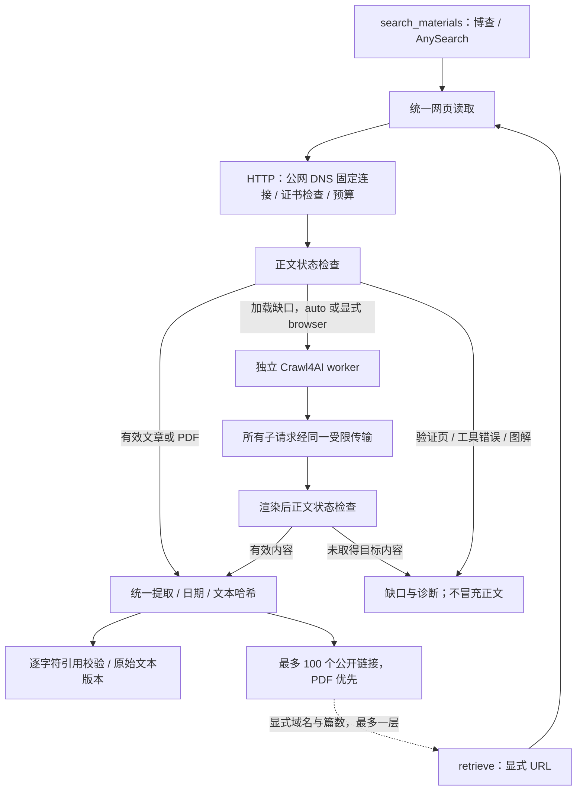

# 统一网页读取与可选浏览器

2026-09-16。`search_materials` 与 `retrieve` 的公开网页共用包内 `read_web_document`。博查/AnySearch 仍负责发现；Crawl4AI 只提供可选渲染，网页本身才是出处。没有 LLM、浏览器登录态或隐式研究编排。



## 安装

基础安装仍支持 Python 3.9，无需浏览器。浏览器需 Python 3.10+；本轮实际使用 Python 3.12。

```bash
python -m pip install '.[crawl,extract,mcp]'
python -m playwright install chromium
```

也可对发布的 wheel 使用相同 extras。在目标电脑独立安装 Chromium；Linux 可能还需 Playwright 的系统依赖。MCP 必须使用安装了这些依赖的同一个解释器。可用 `PLAYWRIGHT_BROWSERS_PATH` 显式指定本机浏览器位置。

当前只接受审查过的 `crawl4ai==0.9.3`。其他版本返回 `browser_version_unsupported`，缺包返回 `browser_dependency_missing`，缺 Chromium 返回 `browser_unavailable`；普通 HTTP 读取仍可用。`list_capabilities().web_reading` 显示依赖元数据，`runtime_verified=false` 表示没有启动浏览器或探测网络，不能当在线健康证明。

## 同一组 SDK/MCP 参数

- `web_read_mode="auto"`（默认）：先 HTTP；仅在观察到加载缺口时尝试浏览器。NVIDIA/Apple 指定财报目录有明确的加载判断。静态页面不启动浏览器。
- `web_read_mode="http"`：不启动浏览器。
- `web_read_mode="browser"`：HTTP 校验后请求渲染。权限、TLS、策略拒绝、验证页不会因此被绕过。PDF 使用原有 PDF 提取。

```python
from ir_search import MaterialRequest, RequestContext, retrieve

result = retrieve(MaterialRequest(
    question="financial reports and earnings call transcripts",
    urls=["https://investor.nvidia.com/financial-info/financial-reports/default.aspx"],
    web_read_mode="auto",
    max_chars=50000,
), context=RequestContext(timeout_seconds=60, max_operations=100)).to_dict()
```

`search_materials(MaterialSearchRequest(..., providers=["web"], web_read_mode="auto"))` 使用同一策略；MCP 两个工具都暴露 `web_read_mode`。没有新增要求 skill 认识 Crawl4AI 的工具入口。

## 正文、出处与引用

`read_details.content_state` 区分：

| 状态 | 含义与处理 |
|---|---|
| `article_text` / `document_text` | 取得文章或文档文本；不证明完整性或事实正确 |
| `directory_links` | 取得资料目录和链接；附件尚未读取 |
| `loading` | 目标内容仍在加载，不能算正文 |
| `challenge` | 访问验证或拒绝页面，不能算正文 |
| `image_only` | 图解等目标材料需要图片/OCR能力 |
| `extractor_error` / `empty` | 提取失败或未取得文本 |

判断来自可复核规则，有误判和漏判可能，不将其包装成语义理解或完整性保证。`retrieve` 对后五种状态不返回正文材料，保留 `reads[]` 与错误诊断；`search_materials` 可以保留明确标注的搜索摘要/元数据，不升级成原文。

浏览器返回渲染 HTML，由本项目原有解析器提取。没有使用 Crawl4AI 的精简 Markdown、自动内容过滤或模型提取，避免财务限定语、单位和资料链接被删去。`raw_hash` 对应本次 HTML/PDF 字节，`text_hash` 为实际返回文本的 SHA-256。原始 HTML 在处理期间使用，不自动永久存档；调用方应保存需要复核的返回文本与出处。

每条 `retrieve` 引用满足 `span.text == material.text[start_char:end_char]`，`span.extra.text_hash` 与材料一致。`search_materials` 引用绑定 `version_id`、`source_part` 和该部分的 `source_part_hash`；标题引用不能冒充正文引用。重复句子按字符位置区分。截断状态只表示实际返回内容的边界。

位置单位是 Unicode 码点（`offset_unit=unicode_code_points`），不是 UTF-8 字节或 JavaScript UTF-16 编码单元；包含 emoji 时，调用方也应按码点核对。

支持明确元数据中的 `YYYY/MM/DD HH:MM` 日期，保留原字段、原始值、解析规则和时区是否已知；日期冲突有诊断，不从版权年份或抓取时间猜发布日期。

## 有限发现、附件与增量处理

每份材料的 `links` 最多 100 条，优先 PDF，含 `url/text/kind/status`；`status=discovered_not_retrieved`。即使它是财报链接，也不能引用未读文件内容。链接截断与正文截断分别标记。

`retrieve` 可显式展开一层链接：

```python
request = MaterialRequest(
    question="earnings revenue",
    urls=["https://investor.nvidia.com/financial-info/financial-reports/default.aspx"],
    follow_links=2,                         # 默认 0，最大 10
    link_domains=["nvidia.com", "q4cdn.com"], # 调用方明确允许的目标域名及子域名
    max_chars=50000,
)
```

只从初始页面展开一层，优先已发现的 PDF；去除重复，不继续展开子页面。全部读取共用总期限和操作预算，重定向也受目标域名限制。初始 URL 最多 10 个，额外跟随最多 10 个。`discovery.complete=false` 始终表示不是全站穷尽。不会为了展开链接调用公众号供应商等带凭证的补充接口。PDF 需可选提取依赖，超过下载限制、图像 PDF 或提取失败均保留诊断。

后续运行可传 `previous_text_hashes={公开URL: 上次text_hash}`，取得 `read_details.change_state=new/changed/unchanged`。重定向后的材料 URL 也可作为比较键。请保持相同 `max_chars` 和读取模式：这是**返回文本**的变化检测，不代表未读取部分、PDF 全部页面或目录附件均未变化。

该增量接口仍会重新取数，以记录当前读取时间；不省略网络请求，不以旧缓存冒充最新正文。skill 可对 `unchanged` 跳过重复分析、对新链接显式取文。服务不自动建立持久化索引、定时运行或向他人推送。

## 浏览器与预算

- 独立 worker、不继承私有 provider/model Key、dotenv、环境代理或 Python 启动钩子；浏览器使用一次性上下文，不使用个人浏览器资料。
- 用固定、可审查的启动参数启用 Chromium sandbox，验证 HTTPS；不继承上游版本的证书绕过参数。
- 浏览器请求由 `route.fulfill` 经项目传输完成：重新检查每个公网解析结果，连接该数字地址并验证原域名证书。浏览器自身走拒绝外连的本机代理；服务 worker、WebSocket、弹窗、子页面导航和图片/媒体/字体请求受限制。
- 子请求只允许 GET。NVIDIA 三个、Apple 四个已观察到的同源只读资料接口另有固定路径规则，允许网站自己的前端查询参数和读取 POST；不全局放开带 Key 的 URL。来源链接仍必须无凭证。
- 浏览器主页面检查 robots 规则；robots 拒绝或不能安全确定规则时中止渲染，404 表示未找到规则并保留诊断。此处不宣称已对原有普通 HTTP 读取增加 robots 功能。
- 最多 4 个子请求并行，单响应最多 8 MiB，浏览器响应体累计按最多 32 MiB 预算；响应正文、机器人规则和重定向均计入。失败但字节数未知的读取保守扣除预留预算，`received_bytes` 与 `charged_bytes` 分别反映已知接收量和扣账量，不包含 TLS/HTTP 协议开销。
- SDK 可设置总期限和最多 100 次操作；MCP `retrieve` 也为 100 次操作并共享总期限。浏览器启动计一次，子请求另计；一次目录读取可超过 30 次。默认 30 秒，复杂目录可显式给 60 秒。
- 父进程在取消/超时后结束 worker 及进程树；不接受迟到结果。初始 HTTP 的 DNS/提取仍有协作式检查边界。JavaScript 堆设置 512 MiB 上限，**不等于浏览器总内存硬上限**。

包内实现不依赖 Desktop/BrokerSkills、个人绝对路径或 checkout 脚本。跨操作系统运行仍需各机浏览器与系统依赖验收；本轮实际浏览器测试平台是 macOS ARM64。

部署后的实取结果见 [统一读取层验收](web_reader_acceptance.md)；前期选型对照见 [Crawl4AI 评估快照](crawl4ai_evaluation.md)。

公众号使用同一隔离浏览器 worker，但仍由专用 `js_content` 解析器提取，保留账号、发布日期和来源语义；其 HTTP → 可选浏览器 → 极致了链路与私有缓存见[公众号读取指南](wechat_material_adapter.md)。


## 机构与官网取材增强（2026-09-17）

已增加 14 条有出处的机构目录、显式官网范围 `web_institutions`、监管目录/附件识别、HTTP 正文有界并发 `web_read_workers` 和无网络执行预览 `dry_run`。目录随安装包分发，SDK 与 MCP 均可调用；详见[使用说明](material_hardening.md)。

2026-09-18：通用网页新增显式 `scrapling` / `firecrawl` 读取模式；素材搜索新增 `providers=["rss"]`。可选依赖、配置、引用口径和限制见 [网页与订阅源改进](web_toolkit.md)。默认读取方式不变。
