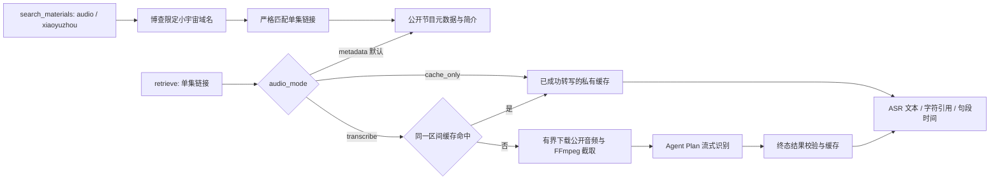

# 小宇宙与火山 Agent Plan 音频

`xiaoyuzhou` 是独立素材来源，内容类型 `audio`。搜索由国内博查发现公开单集页面，再按预算读取小宇宙节目简介；显式 `retrieve` 可将指定音频区间送到火山 Agent Plan 转写。实现与本地参考技能独立，可通过安装包的 SDK 和 MCP 使用，不连接旧 `deep_research`。

## 接入依据与配置

依据火山方舟[接入语音模型](https://ark.volcengine.com/region:cn-beijing/docs/82379/2516286?lang=zh)（核对于 2026-09-17，页面更新于 2026-09-14）及其链接的[流式语音识别协议](https://docs.volcengine.com/docs/6561/1354869?lang=zh)：

| 配置 | 当前实现 |
|---|---|
| 套餐 | Agent Plan 专属 API Key |
| 模型名称 | `doubao-seed-asr-2.0` |
| 资源标识 | `volc.seedasr.sauc.duration` |
| 接口 | `wss://openspeech.bytedance.com/api/v3/plan/sauc/bigmodel_nostream` |
| 认证 | `X-Api-Key`，只发送至上述固定 TLS 主机 |
| 请求内模型字段 | 官方协议要求 `model_name=bigmodel` |
| 音频 | 16 kHz、16-bit、单声道 PCM，约 200 ms 一包 |

模型字段与展示名称不同，是官方协议的约定。此接口以接近实时速度上传音频；没有沿用参考技能的普通录音文件 URL 异步接口，没有普通计费接口回退。关闭语义顺滑和数字逆规范化，保留标点与句段时间，不生成摘要、不推测说话人身份。

每台电脑的私有 env 配置如下；`credentials.env.example` 只保存空密钥模板。当前开发机已启用并保留原有 `VOLC_ASR_API_KEY` 值。

```dotenv
XIAOYUZHOU_MATERIALS_ENABLED=true
BOCHA_API_KEY=
VOLC_ASR_ENABLED=true
VOLC_ASR_PLAN=agent_plan
VOLC_ASR_API_KEY=
VOLC_ASR_MODEL=doubao-seed-asr-2.0
VOLC_ASR_RESOURCE_ID=volc.seedasr.sauc.duration
VOLC_ASR_ENDPOINT=wss://openspeech.bytedance.com/api/v3/plan/sauc/bigmodel_nostream
AUDIO_CACHE_DIR=.local/audio-cache
```

安装 `pip install 'ir-search[audio,mcp]'`，并自行安装可在 PATH 中找到的 FFmpeg。ASR 使用固定版本 `websockets==15.0.1`；基础搜索/简介读取不需要这两个音频依赖。更换电脑后以 `IR_SEARCH_CREDENTIALS_FILE` 指向该电脑的私有 env，缓存相对路径以 env 所在目录解析。`source_health` 返回配置及依赖状态，配置成功不等于账号权限或实时可用性已经验证。

## 调用流程



SDK 示例：

```python
from ir_search import MaterialSearchRequest, MaterialRequest, RequestContext, search_materials, retrieve

found = search_materials(MaterialSearchRequest(
    question="AI 投资", providers=["xiaoyuzhou"], material_types=["audio"],
    published_start="2025-01-01", published_end="2025-12-31",
    candidates_per_source=5, text_reads_per_source=3,
), context=RequestContext(timeout_seconds=60, max_operations=20))

episode_url = "https://www.xiaoyuzhoufm.com/episode/6a042c61e1eb34a93950f9a6"
notes = retrieve(MaterialRequest("AI 投资", [episode_url]))
clip = retrieve(MaterialRequest(
    "AI 投资", [episode_url], audio_mode="transcribe",
    audio_start_seconds=0, audio_max_seconds=60,
), context=RequestContext(timeout_seconds=150, max_operations=20))
```

MCP `retrieve` 接受同名参数，另用 `timeout_seconds=150`。`audio_mode` 仅支持 `metadata`、`transcribe`、`cache_only`；`cache_only` 仍读取节目当前公开页面，未命中缓存时明确返回缺失，不调用 ASR。

每个窗口为 1–180 秒，默认 60 秒；`audio_window_count=1..5` 控制本次连续读取多少个窗口，默认 1。起点为非负整数秒，最大 604800。调用方检查 `read_details.next_start_seconds`，再显式请求下一批。长节目应由 skill 按研究需求控制总用量，不能把首批片段称为整集转写。全局请求上限 300 秒，流式上传需要接近音频时长的墙钟时间，还需留下载和处理时间；余量不足会在下一次 ASR 前拒绝。

多段读取逐段复用缓存，`window_manifest` 记录各段实际范围、字符位置、音频/PCM/文本哈希及是否调用模型；句段时间转为整集绝对偏移。`windows_completed` 与 `windows_requested` 分开。后段普通失败返回已完成内容和 `window_failure_code`；请求已取消或总期限耗尽时，服务仍遵守停止规则，成功片段保留在私有缓存，后续用相同分段参数复用。音频哈希变化或实际解码出现缺口时停止拼接，不伪造连续全文。转写完成范围与返回字数截断分别披露。

例如 `audio_max_seconds=12, audio_window_count=2` 请求连续 24 秒；后续起点从返回值取得，不能按计划窗口数推算。`cache_only` 可以读取多段已完成缓存，遇到缺失不调用模型。本轮两段真实验收及第二次零 ASR 复用见[可用性记录](source_usability_acceptance.md)。

## 证据与边界

- 搜索索引只提供有界发现，不保证整档节目、最近七天或指定时间段的全量覆盖。发布日期在本地过滤，日期未知另行标记；博查搜索摘要与已读取简介分别标记 `search_snippet` / `source_excerpt`。`dry_run` 不请求网络、不转写。
- 节目简介属于来源文本，附 `show_notes_not_transcript`。页面里仅有 `transcript.mediaId` 不视为可取得的文稿；没有绕过登录去调用平台私有转写接口。
- ASR 返回 `text_origin=asr_transcript`、`machine_transcribed=true`、模型、识别时刻、原音频/PCM/文本哈希、实际起止和缓存状态。句段时间使用官方返回的毫秒偏移，加上输入窗口起点；无句段时间就不生成时间引用。引用字符与实际文本逐一校验。
- ASR 属于机器识别文本，可能有错字、数字和人名识别错误，不能等同人工核验。来源继续是 UGC/opinion；`provenance.generated=false` 仅表示未生成研究总结，必须结合 `machine_transcribed` 使用。无已验证的小宇宙网页时间跳转规则，因此不编造带时间参数的播放链接。
- 仅接受公开、免费单集；不读取评论、整档节目列表、登录、付费或受限内容。目前只支持平台页面声明且位于 `media.xyzcdn.net` / `media.typlog.com` 的公开 HTTPS 音频，不使用私人 Cookie 或认证媒体链接。未知 CDN 明确失败，后续须实测后纳入。
- 原音频最大 96 MiB；支持 MP3、M4A/MP4、WAV、FLAC、OGG。先通过公网校验与 DNS 固定的传输下载到私有目录，FFmpeg 仅读取本地文件，不让 FFmpeg 自行访问网络。大文件、音频格式、接口权限、依赖、预算、取消与超时均有明确失败码。
- 为适配流式接口，需要本地取得音频；参考技能“云端不下载”的做法针对另一种 API，不能套用。音频缓存复用期 24 小时，转写结果最长 30 天；成功窗口按媒体地址、模型、账号范围、密钥指纹和参数隔离，重复请求复用结果。文件 0600、目录 0700，缓存清理上限 128 个文件 / 256 MiB；活跃下载可暂时额外占用最多一个 96 MiB 文件。磁盘缓存损坏不会静默重新收费转写。
- 不自动重试已开始的 ASR。连接中断仍可能消耗套餐，失败后由调用方决定是否重试。Agent Plan 实际扣费取决于账户超额计费设置；本项目没有读取或修改该设置，也不承诺此调用绝对免费。搜索计费仍按博查账户规则。缓存命中不调用音频模型。

主要实现：`adapters/platform_materials.py`、`infrastructure/audio_documents.py`、`infrastructure/audio_asr.py`。本地参考库记录了上游 `podcast-fetch` 说明和官方协议出处，未执行上游 skill 或复制其运行环境。真实结果及部署验收见[音频验收记录](xiaoyuzhou_audio_acceptance.md)。
