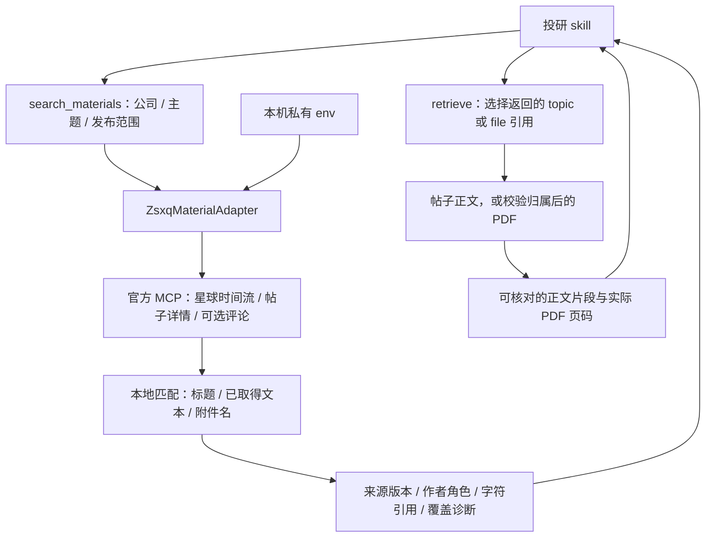

# 知识星球投研素材 adapter

2026-09-15：独立的 `ZsxqMaterialAdapter` 已接入 `search_materials`；`retrieve` 支持帖子和其 PDF 附件。实现及测试均在本仓库，运行时不读取或执行 BrokerSkills、浏览器登录配置或 `zsxq-cli`。

## 取材方式与职责

借鉴华福 skill 的星球选择、按时间浏览、帖子取材和附件发现流程，连接部分改用已实测的官方 HTTPS MCP。检索、去重、证据分层和引用交给 `ir_search`；行业分析与研究结论交给调用方 skill。没有迁入自动 LLM 总结或无限历史抓取。



官方 `search_topics` 是 RAG 检索，当前没有纳入确定性搜索热路径。当前方法是**有限时间流取回后本地匹配**；不能据此声称已搜遍星球历史。官方语义检索与分页约束见 [topic-search](https://github.com/unnoo/zsxq-skill/blob/main/skills/zsxq/references/topic-search.md)、[group-topics](https://github.com/unnoo/zsxq-skill/blob/main/skills/zsxq/references/group-topics.md)。

## 每台电脑的配置

使用 `credentials.env.example` 中的以下字段，真实值只写入本机私有 env：

```dotenv
ZSXQ_MATERIALS_ENABLED=true
ZSXQ_KEY=
ZSXQ_GROUP_IDS=
ZSXQ_MAX_GROUPS_PER_QUERY=3
ZSXQ_MAX_PAGES_PER_GROUP=2
ZSXQ_COMMENTS_PER_TOPIC=0
```

- `ZSXQ_KEY`：已授权的官方访问凭证，客户端通过 Authorization 发送到固定的 `https://mcp.zsxq.com/topic/`。不会传给旧 CLI adapter，也不会用浏览器 Cookie 回退。
- `ZSXQ_GROUP_IDS`：有权访问的星球 ID，逗号分隔、顺序代表优先级，最多 50 个。每次只扫描排在前面的预算数量，不自动轮换。留空时读取一次账户星球目录；目录返回页不保证列出了全部已加入星球。
- `ZSXQ_MAX_GROUPS_PER_QUERY`：默认 3，上限 5。总候选和正文预算在所选星球之间分配；更多星球意味着每个星球分到的预算更少。
- `ZSXQ_MAX_PAGES_PER_GROUP`：默认 2，上限 3；仍受候选总数、请求操作预算和总期限约束。
- `ZSXQ_COMMENTS_PER_TOPIC`：默认关闭；启用范围 1–10，只读取评论第一页，并消耗同一 `text_reads_per_source` 预算。未读或失败均保留提示。

新 adapter 的连接和帖子处理只用基础依赖。提供 MCP 服务需要安装 `.[mcp]`；读取 PDF 需要 `.[extract]` 中的 PyMuPDF，缺少时返回 `dependency_missing`。不要求 CLI、浏览器或登录钥匙串。异地启动时用 `IR_SEARCH_CREDENTIALS_FILE` 指向该电脑的私有 env，见[跨电脑部署](standalone_deployment.md)。`source_health` 配置成功不等于在线权限已经通过。

## skills 调用示例

这个例子显式选择 2026 年 9 月业务期间，并允许随后发表的回顾文章进入发布日期范围；它不保证当前账户有对应动销材料。

```python
from ir_search import (
    MaterialSearchRequest, MaterialRequest, RequestContext,
    search_materials, retrieve,
)

result = search_materials(MaterialSearchRequest(
    question="贵州茅台9月动销",
    symbols=["600519.SH"], keywords=["动销", "渠道库存"],
    published_start="2026-09-01", published_end="2026-10-15",
    period_start="2026-09-01", period_end="2026-09-30",
    providers=["zsxq"],
    candidates_per_source=18, text_reads_per_source=3, max_chars=10000,
), context=RequestContext(timeout_seconds=60, max_operations=30)).to_dict()

# 先检查 required_inputs、coverage、diagnostics，再选择匹配材料。
if result["items"]:
    version = result["items"][0]["versions"][0]
    material = retrieve(MaterialRequest(
        question="动销与渠道库存", urls=[version["source_ref"]],
    )).to_dict()
    # 需要附件时，从 version["attachments"] 选中 PDF 的 source_ref，
    # 再单独交给 retrieve；附件名命中不代表已读附件正文。
```

MCP 使用已有 `search_materials` / `retrieve` 工具，直接传相同请求字段。`search_materials` 可通过 `timeout_seconds` 配置期限；默认 30 秒。新实现不增加任意官方工具代理，也不扩建 `deep_research`。

## 返回内容与引用

渠道为 `community`，provider 为 `zsxq`。星球文本保守标为 `social_post` 或 `qa`，来源等级为 UGC。即使标题写着“研报”“纪要”“公司反馈”，也不自动提升为已核验的券商报告、电话会或公司披露。

| 字段 | 含义 |
|---|---|
| `collection_id` / `collection_name` | 来源星球，用于说明检索范围 |
| `source_record_type` | 上游记录类型，如 `talk`、`q&a` |
| `source_ref` | 稳定的 `zsxq://topic/<group>/<topic>` 内部引用 |
| `original_url` | 根据真实 ID 和官方分享格式生成的帖子链接；访问仍受账户权限约束 |
| `sections` | 按帖子、问题、回答、评论或角色未确认切分；保存作者及字符区间 |
| `attachments` | 文件名、大小、类型和 `zsxq://file/<group>/<topic>/<file>` 引用；搜索阶段仅元数据 |
| `evidence_spans` | 绑定 `version_id`、`source_part` 和字符位置；正文片段不会跨越不同角色的区间 |

五种通用 `text_scope` 为 `metadata`、`abstract`、`search_snippet`、`source_excerpt`、`extracted_text`。星球时间流返回的文字标为 `source_excerpt`，表示来自来源的文本但完整性未经确认；成功读取普通帖子详情后可标为 `extracted_text`，仍保留截断及其他缺口。

**问答角色有明确限制：**真实官方简化响应的 `question.questionee` 是被提问人，不能当作回答作者；样本没有分开的问答正文。此时内容保留为 `source_excerpt`，区间角色为 `unverified`、作者留空，并返回 `question_answer_roles_unverified`。仅当接口明确提供独立问题/回答正文及作者字段时，才按字段分段；这一分支已做合成测试，尚未通过相应真实样本验收。官方详情格式见 [topic-detail](https://github.com/unnoo/zsxq-skill/blob/main/skills/zsxq/references/topic-detail.md)。

文件名引用的 `source_part=attachment_name`、`attachment_index` 指向附件数组，字符位置对应文件名，`text_scope=metadata`。正文引用的 `source_role` / `author` / `section_source_ref` 对应段落归属。评论的 `zsxq://comment/...` 仅用于出处标记，当前不支持把评论引用单独传给 `retrieve`。

## 附件正文读取

`retrieve` 先用官方接口验证父帖与星球、确认文件属于父帖，再取得下载链接。仅支持不超过 8 MiB 的 PDF；下载限于已核实的官方 `files.zsxq.com` HTTPS 地址，校验公网目标和重定向，账号凭证不发送给文件服务器。签名 URL 只在请求内存中使用，不进入引用、返回结果或缓存。

PDF 使用实际文本提取和页码映射；扫描件需要 OCR 的情况当前不处理。原始发布方未核验时保留 `attachment_original_publisher_unverified`。父帖日期不当作 PDF 发布日期，后者保持未知。帖子中的图片、嵌套引用帖与非 PDF 附件不自动展开。搜索与读取均不自动持久化全文，调用方可将所需证据保存在私有位置。

## 范围与稳定性诊断

- 发布日期按 Asia/Shanghai 自然日过滤；官方时间流从请求结束日向过去读取。发布日期不推断材料讨论的业务期间，未知业务口径继续暴露。
- 时间游标边界可能重复：按星球和帖子 ID 去重，重复行仍计入读取预算；游标不前进则停止并诊断。
- `coverage[].scans[]` 暴露每个实际扫描星球、接收/检查数量、状态、`has_more`、`next_cursor`；`date_filter_basis=local_publication_metadata` 不表示全范围扫描成功。
- `collection_budget_exhausted`、`community_page_budget_exhausted`、`candidate_budget_exhausted`、`text_read_budget_exhausted` 说明相应预算受限；游标用于诊断，当前公共请求尚无续取游标参数。
- 单个星球无权限不会抹去其他星球；详情读取失败时可以保留来源片段，但不会升级为全文。鉴权、权限、限流、网络、TLS、格式变化和取消分别诊断，无静默模拟或无限重试。
- 官方响应限制 4 MiB；MCP 仅实现已核实的 JSON/SSE 与会话流程。只允许特定读取工具；通用 API 工具被限制为读取指定文件下载地址。

所有来源文字按不可信数据处理。返回保持 `partial` / `complete=false`；内容存在、关键词命中和字符引用成立，都不等于其中的经营数据或研究观点已经被证实。真实结果和已知缺口见[本轮验收记录](zsxq_material_acceptance.md)。
